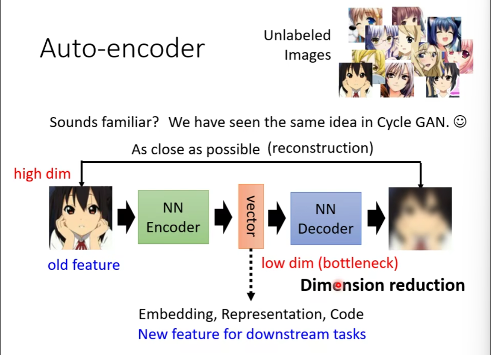
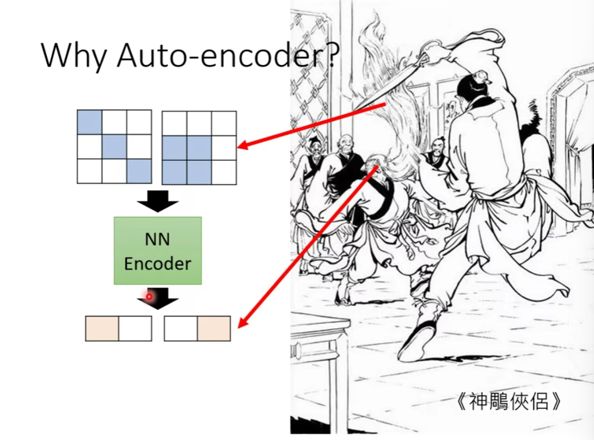
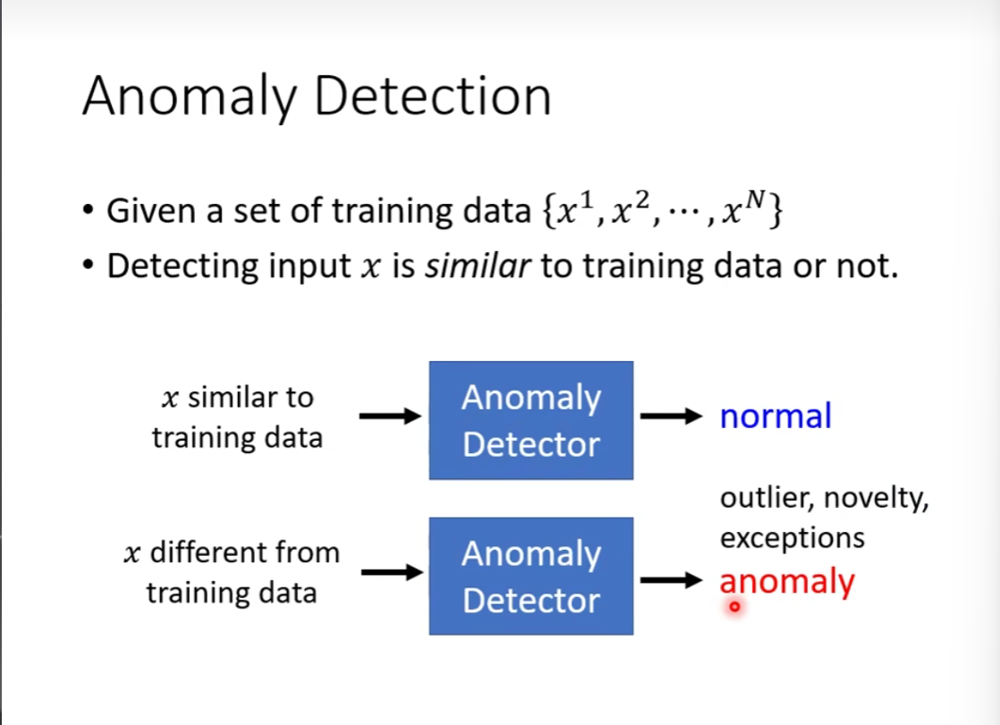

### Auto-Encoder 自编码器

Encoder 做了什么？

化繁为简

发展：de-noising Auto-Encoder

加入噪音

### Feature Disentangle 特征分离

每一个维度代表了什么样的资讯（信息）

### Discrete Representation

对 Embedding 进行离散化规定

### variational auto-encoder 变分自编码器

？

### 异常检测 Anomaly Detection

异常正常是相对的

如果只有一个类别，如何训练一个分类器

