### Bert

#### Self-Supervised Learning

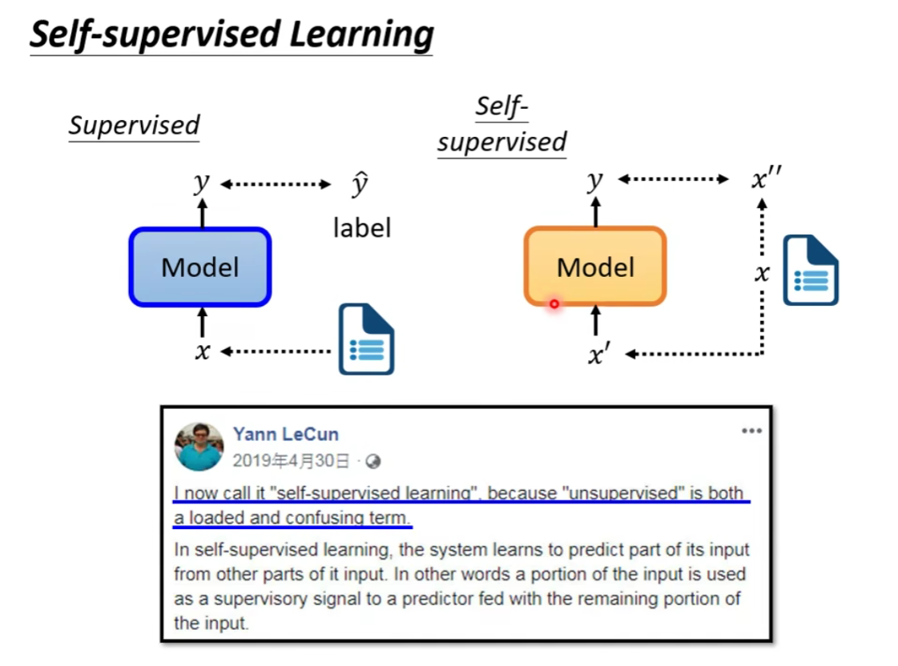

masking input:

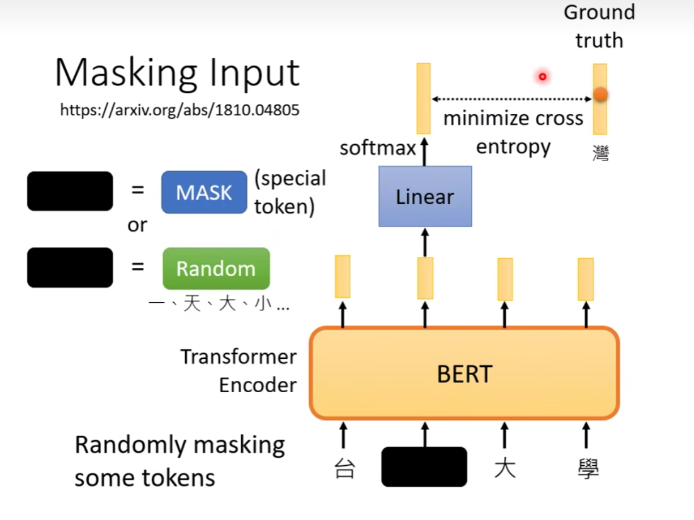

next sentence prediction:

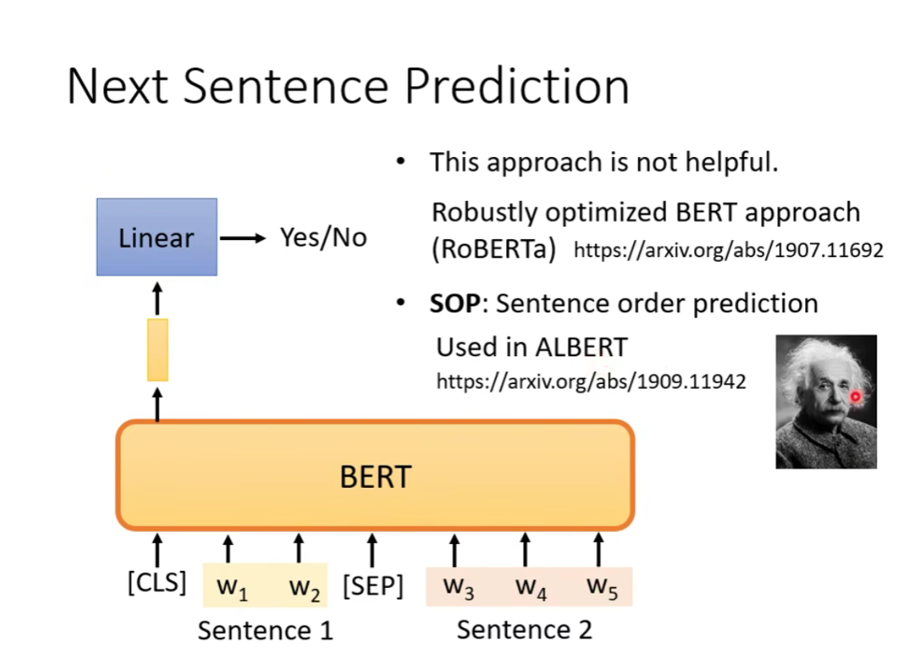

Bert 真正用到的任务：downstream tasks

下游的任务

fine-tune:对bert做一个微调，使得他可以用于各式各样的任务

pre-train

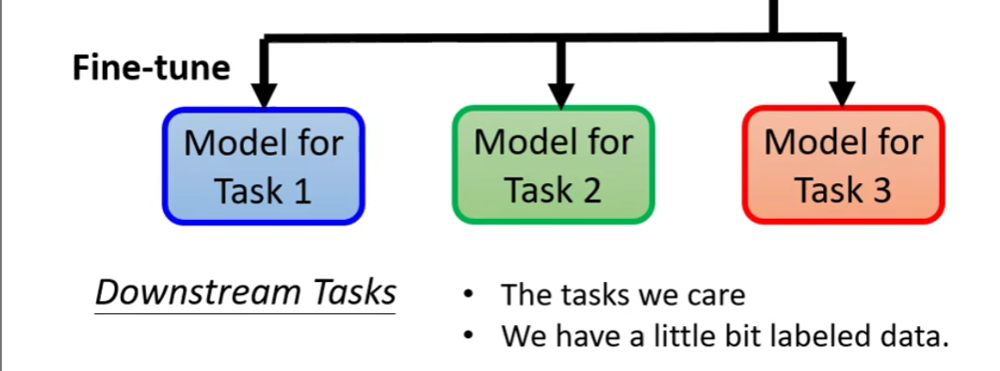

提供一些标注的data

#### GLUE General Language Understanding Evaluation

一个用来评估的任务集

#### 如何使用 Bert （一）

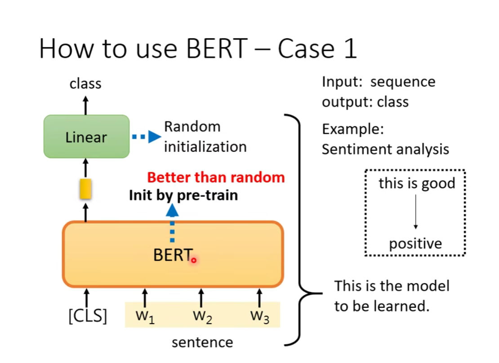

情感分析

#### 如何使用 Bert （二）

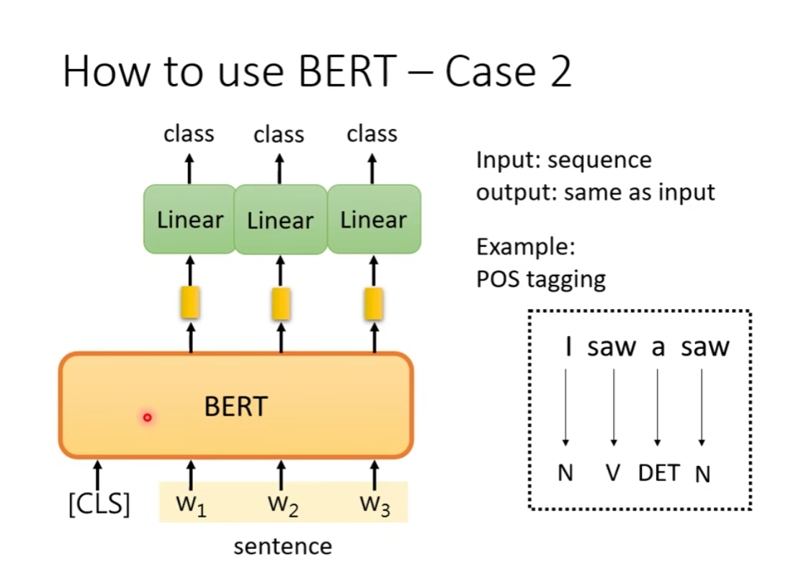

词性标注

#### 如何使用 Bert （三）

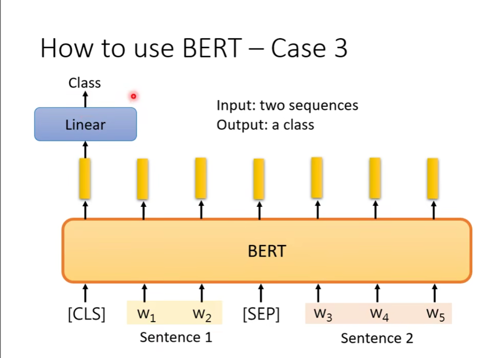

立场分析

#### 如何使用 Bert （四）

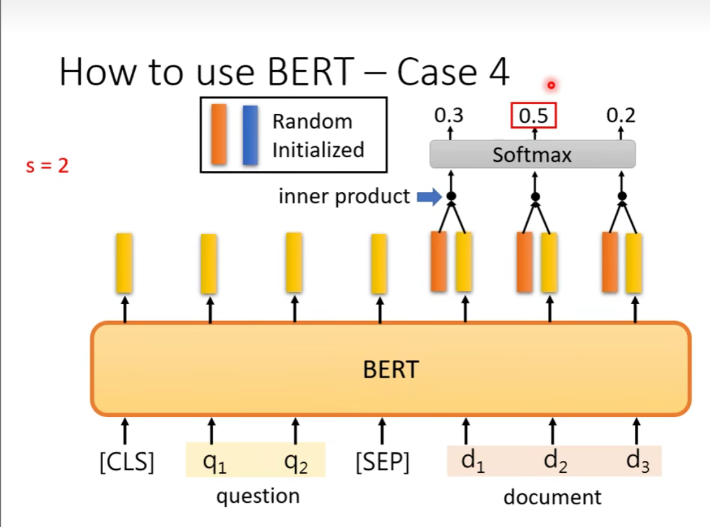

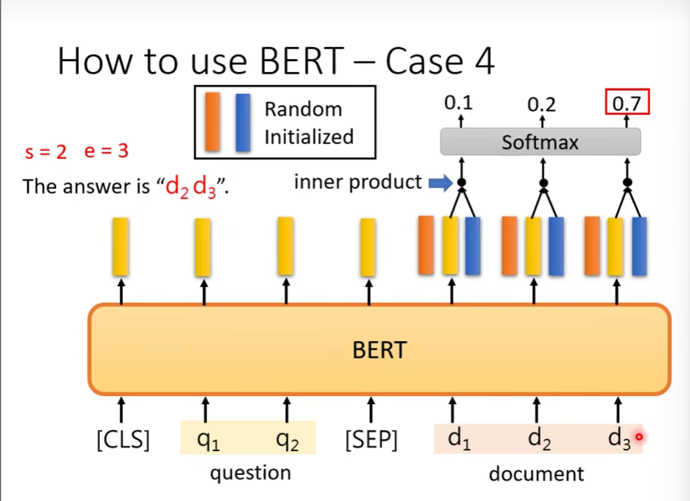

后面是一些bert的应用

#### GPTs

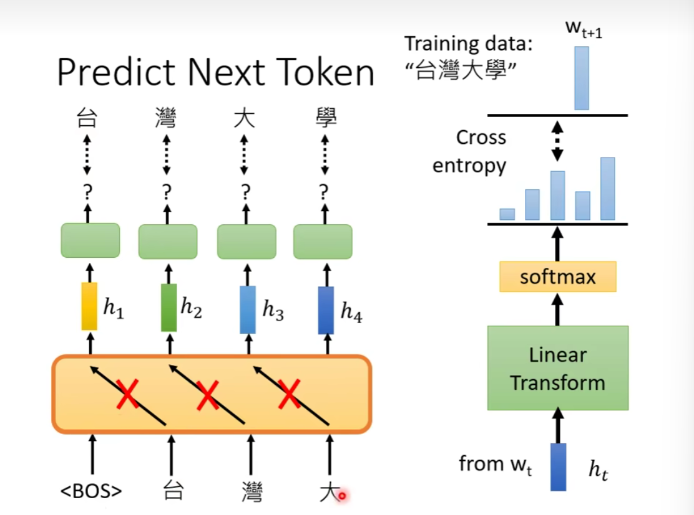

生成能力

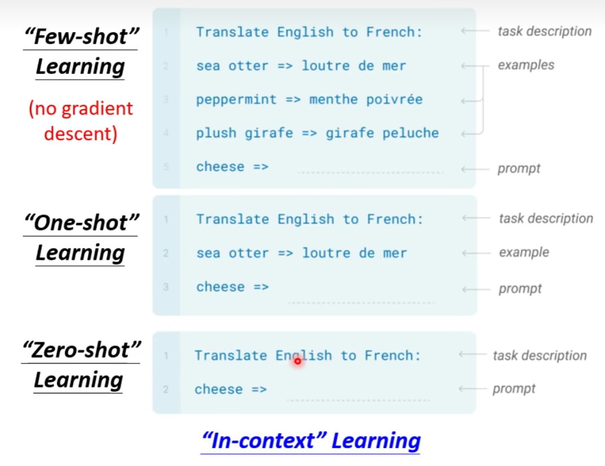

