### Convolutional Neural Network CNN （一）

#### 图像分类 image classification

one-hot vector 来表示目标

图像的基本知识

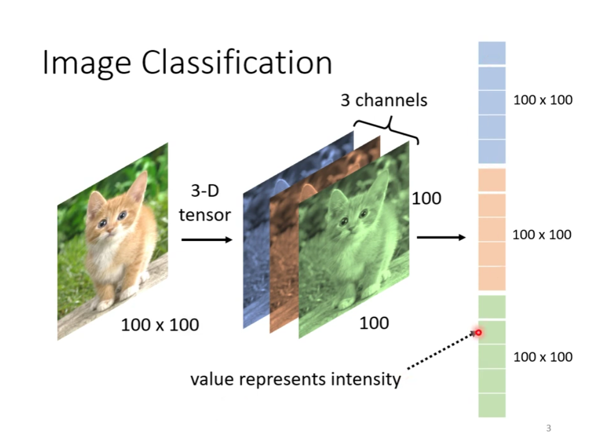

#### 简化一

图像辨识不需要全连接，为什么？

特征识别

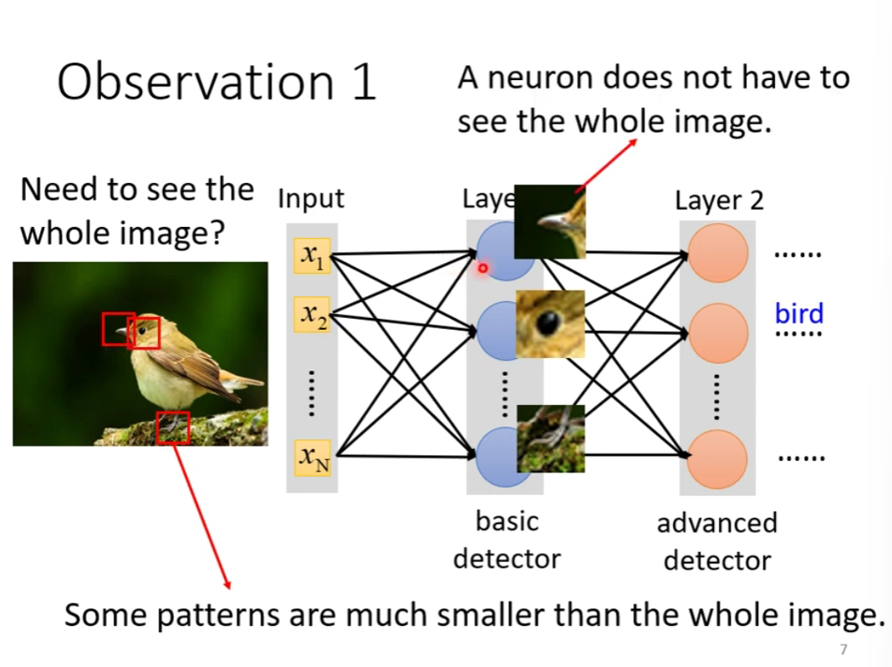

Receptive field

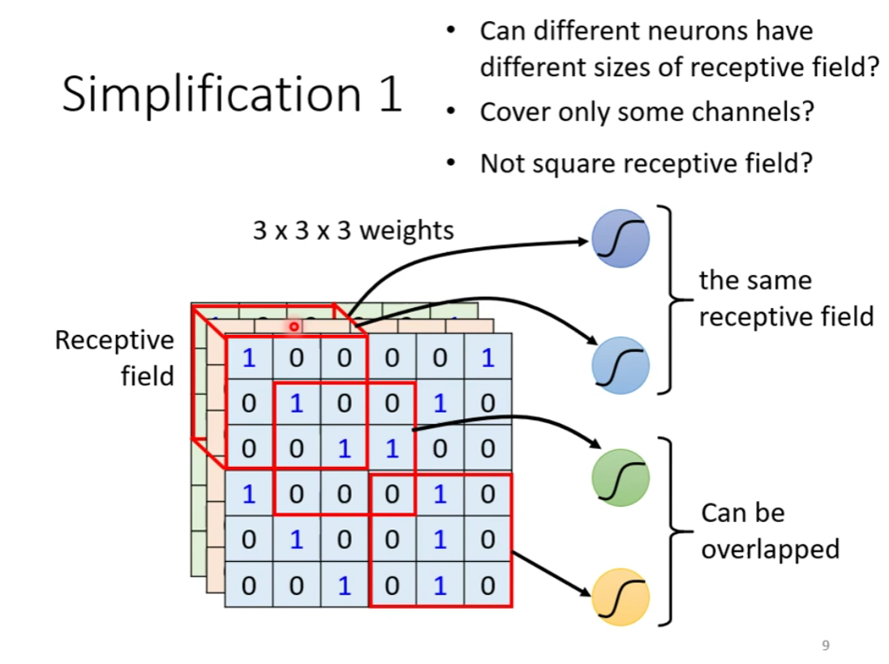

可以任意设计

经典的设计：

**kernal size 核的大小**

**stride 步长**

**padding 填充**

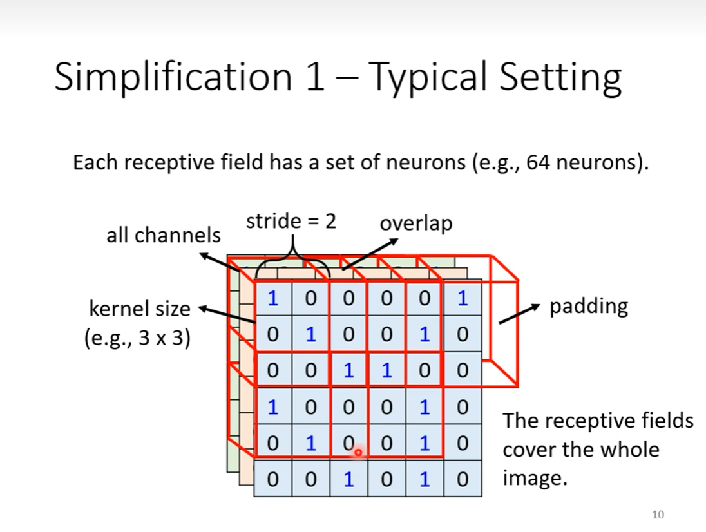

#### 简化二

同样的特征（patterns）可能出现的不同的区域

做的事情是一样的，但是守备范围不同

共享参数

经典的设计：

**filter**

#### 卷积层的优点

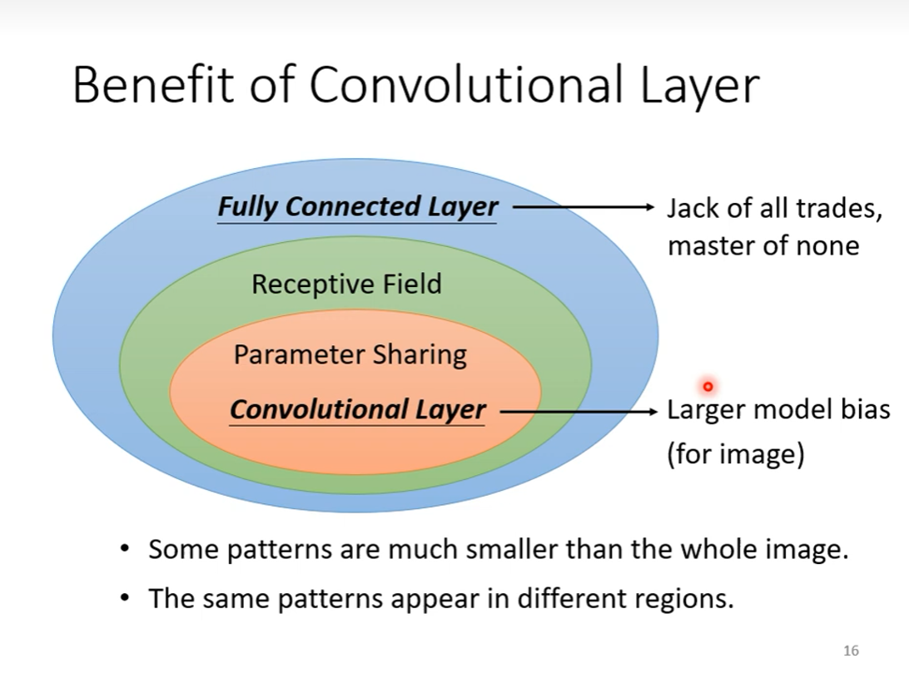

### Convolutional Neural Network CNN （二）

#### 卷积层

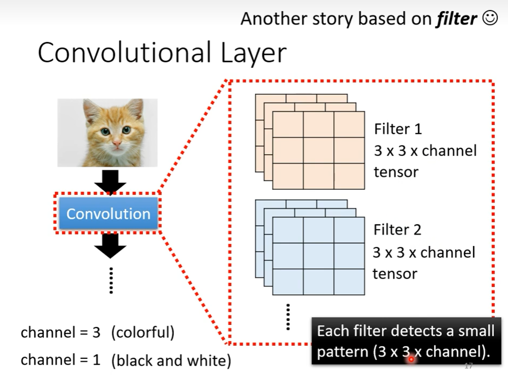

filter 是未知的参数

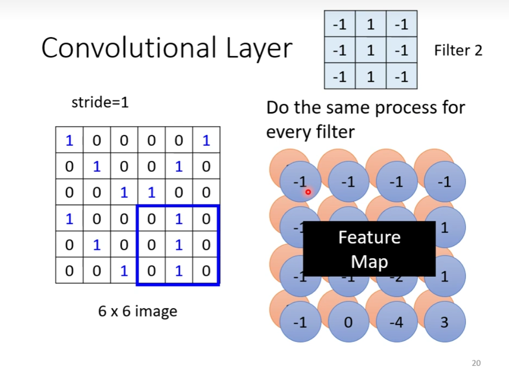

#### 多层卷积

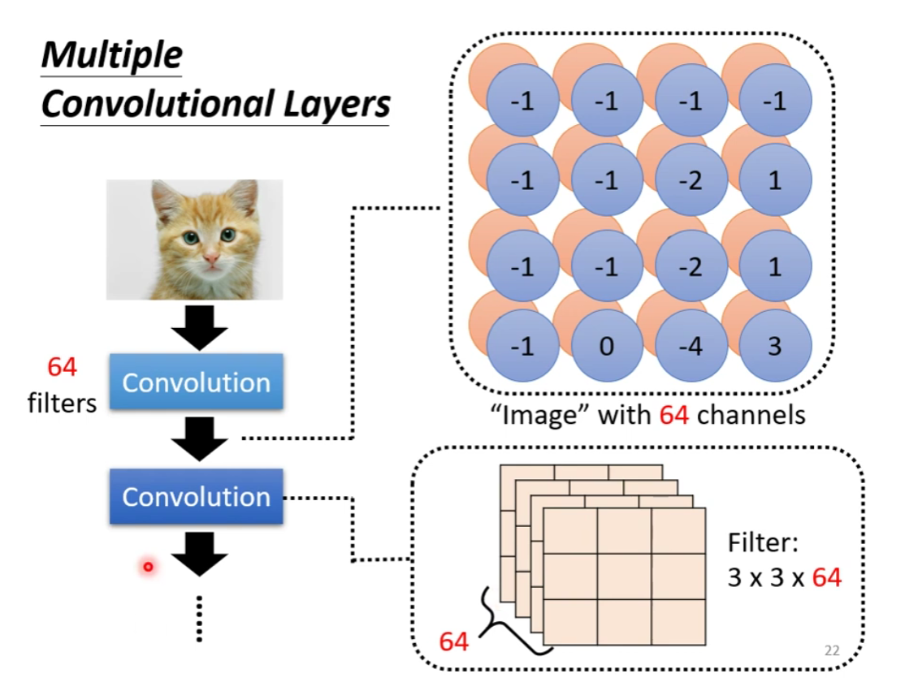

越深的network，后面能看到的特征就越多、越大

共享参数，其实就是让 filter 扫过整个图片

——不同的 Receptive field 可以共用参数，这组共用的参数就叫做 filter

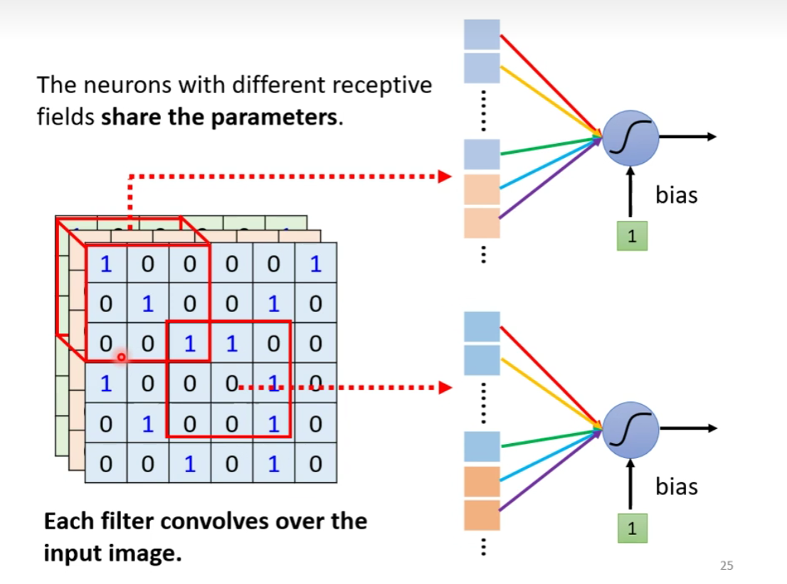

#### pooling 池化

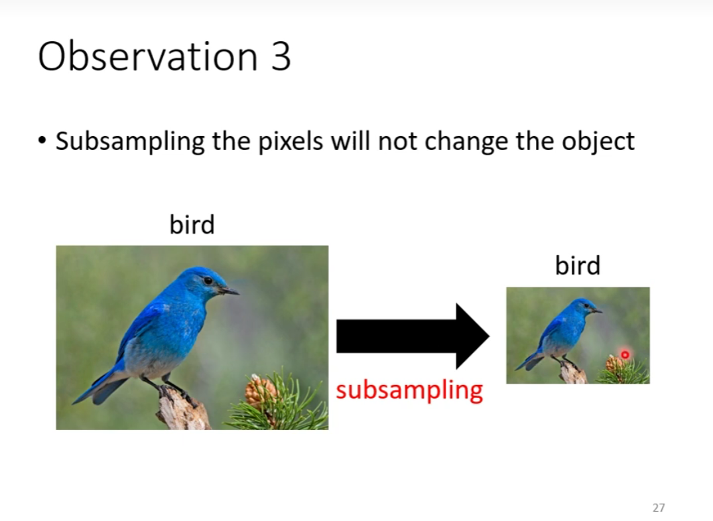

没有需要学习的参数

方法：

- max pooling
- min pooling

通常在 Convolution 之后

### CNN 总结

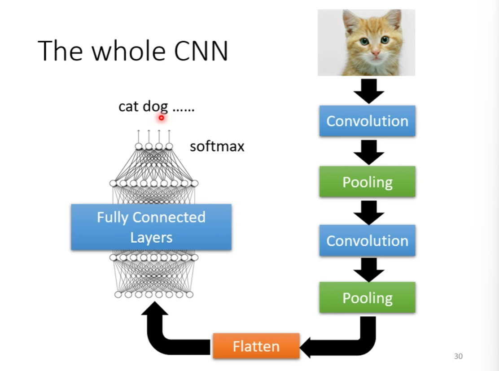

CNN 注重于图像识别

特征模式：特征很小；相同的特征可以出现在不同的区域

pooling 不一定适合所有的任务

