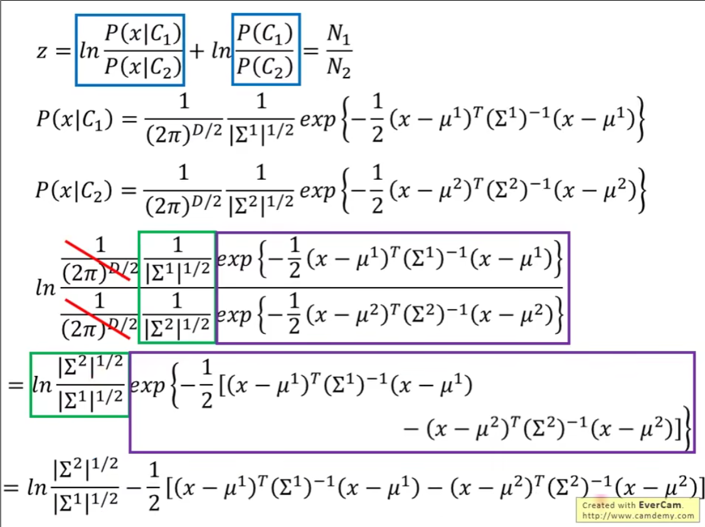

### Classification 分类

#### 利用回归来做分类

回归为了使损失函数 L 尽可能得小，会"惩罚"那些太"正确"的样本。

它会把这类样本当作"误差"，从而偏移原本正确的边界以修正误差

#### 分类的步骤

这里讲的有些简略了。

注意，这里也就是我们所说的贝叶斯概率，考虑贝叶斯公式得到最后的概率。

这里分类也就是生成学习算法，回归是判别学习算法

首先考虑二分类问题，因为它简单

training data 中的样本是从某个类别的分布中生成（抽样, sample）出来的。

一般这个分布取为高斯分布，因为高斯部分在自然界上是非常普遍的。

给定一个全新的 x，我们不能说 x 从该高斯分布中生成的概率是0，为什么？

这里相关知识与概率论有关。

关于为什么在高斯分布中，给定一个新的样本 $ x $，我们不能说 $ x $ 从该分布中生成的概率是 0，可以从以下几个层面详细解释。

#### 1. **离散概率分布 vs. 连续概率分布**

首先要区分**离散分布**和**连续分布**之间的区别：

- **离散分布**：在离散分布中，样本的可能取值是有限的或可数的。比如掷骰子，你可以精确地说骰子掷出 1、2、3 等特定值的概率。
  - 例如：掷出 1 的概率是 $ P(X=1) = 1/6 $。
  
- **连续分布**：在连续分布中，样本的取值是无限的，取值范围是一个区间，比如实数轴上的任意点。因为连续分布的取值是无限的，我们不能精确地说某个特定点的概率是多少，因为单个点的概率是 0。
  - 例如：在标准正态分布中，$ P(X=1) = 0 $。

#### 2. **高斯分布（正态分布）中的概率密度**

高斯分布是**连续分布**的典型代表。它的**概率密度函数** (PDF) 表示的是某个点附近的“密度”大小，而不是某个具体点的概率大小。

高斯分布的 PDF 定义如下：

$$
f(x) = \frac{1}{\sqrt{2\pi \sigma^2}} e^{-\frac{(x - \mu)^2}{2\sigma^2}}
$$

其中：
- $ \mu $ 是均值，表示高斯分布的中心位置。
- $ \sigma^2 $ 是方差，表示分布的宽度或离散程度。
- $ x $ 是我们关心的样本点。

在这个公式中，**$ f(x) $ 表示的是某个点 $ x $ 的概率密度**，而不是该点的概率。

##### **PDF vs. 概率**

- **概率密度函数 (PDF)** 是描述在某个点附近区域发生事件的可能性，它不是直接的概率值。
- **概率**是在某个范围内积分 PDF 得到的数值。

例如，PDF 的值可以告诉我们某个点 $ x $ 附近有多可能生成样本，但真正的概率要通过积分计算：在区间 $ [a, b] $ 内的概率 $ P(a \leq X \leq b) $ 是通过对 PDF 进行积分得到的：

$$
P(a \leq X \leq b) = \int_a^b f(x) dx
$$

由于连续分布的性质，单个点的概率是 0，因为积分的上下限是同一个值（没有宽度）。比如，某个具体的 $ x = 1.5 $ 的概率 $ P(X=1.5) $ 为 0。

#### 3. **为什么生成概率不是 0？**

高斯分布的 PDF 是光滑且连续的，这意味着即使是一个新样本 $ x $，我们可以通过 PDF 计算出它在该分布下的密度。虽然单个点的生成**概率**是 0（因为这是一个连续分布），但 PDF 在 $ x $ 处的值仍然可以大于 0。这表示 $ x $ 附近的区域仍然有可能生成数据，换句话说，样本 $ x $ 出现并非不可能。

##### **直观解释：**
你可以把 PDF 想象成一个山丘：
- 山丘的高度表示密度的大小。
- 在山丘上的任何点（即任意 $ x $）都会有某种高度（即密度），表示在这个点附近生成数据的可能性。
- 但是如果你要问在一个精确的点上生成的概率是多少，就像是问在这个点上有多少面积，答案是 0，因为点本身没有面积。

即使 $ x $ 是新的、从未见过的样本，只要它位于高斯分布的“山丘”范围内，它的密度值（即山丘的高度）仍然会大于 0，意味着它出现的可能性不为 0。

#### 4. **总结**

- 在连续分布（如高斯分布）中，**单个点的概率是 0**，因为在连续分布中，生成特定点的概率是通过积分计算的，而积分区间为 0 时，结果是 0。
- 但我们不能因此说某个新的样本 $ x $ 是不可能生成的，因为我们关注的是它的**概率密度**，而不是具体的生成概率。
- 高斯分布的概率密度函数几乎在整个实数轴上都是正值，因此无论新的样本 $ x $ 是什么，只要它不是极端值，它的生成概率密度 $ f(x) $ 都大于 0。

得到概率密度分布

如何寻找其中的参数 μ 和 Σ 呢？——通过极大似然估计

理论上，任何一个点都可以通过某一个高斯分布生成，只是生成概率的高低不同

反过来，给定一个点集，任何一个高斯分布能够生成该点集，只是生成概率的高低不同

各种不同的高斯分布，对应该点集的概率也不同。

这个概率我们用极大似然来估计

 

协方差矩阵共享——减少参数数量

分类边界变成线性的

#### Posterior Probability 后验概率

朴素贝叶斯效果的好坏，取决于 i.i.d 的假设是否符合实际

##### 数学推导

为什么边界会是线性的？

因为当协方差矩阵共用时，sigmoid 函数实际上就可以表达为线性的

