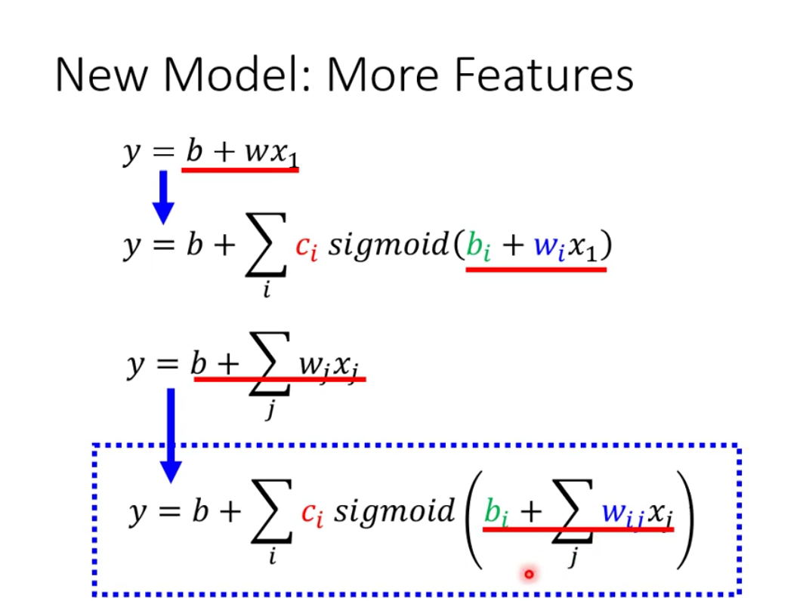
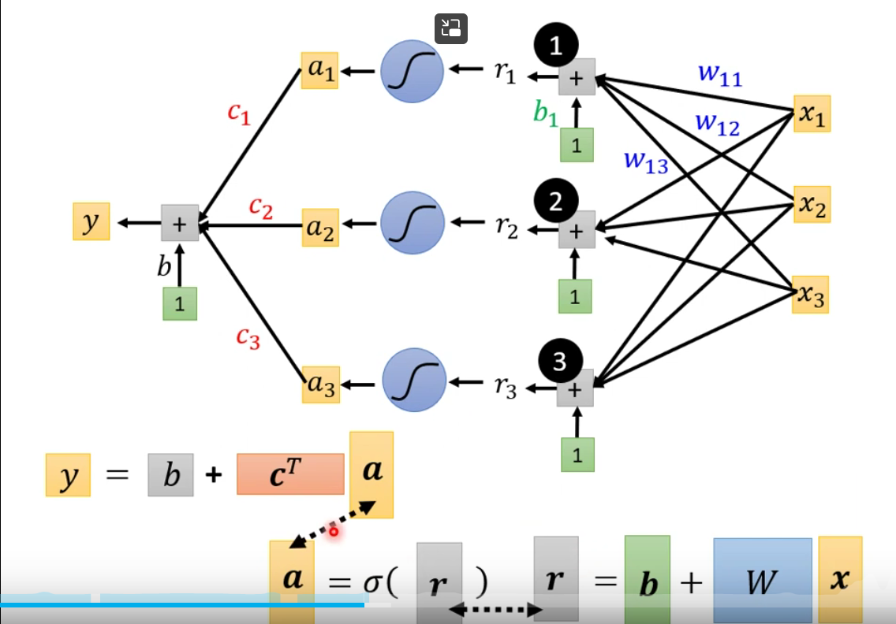
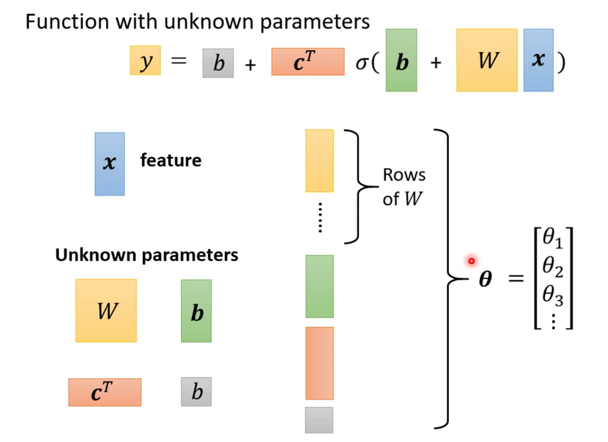
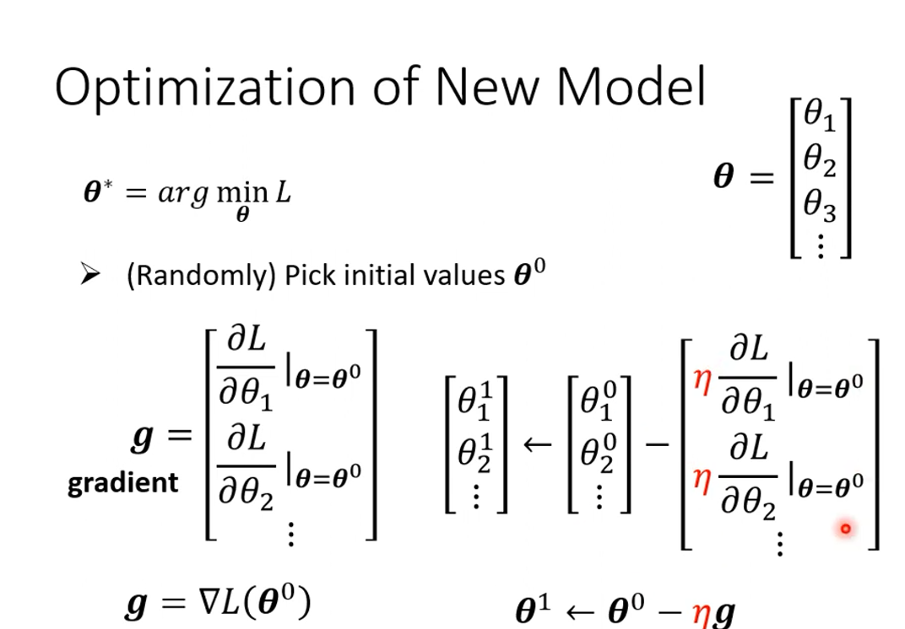
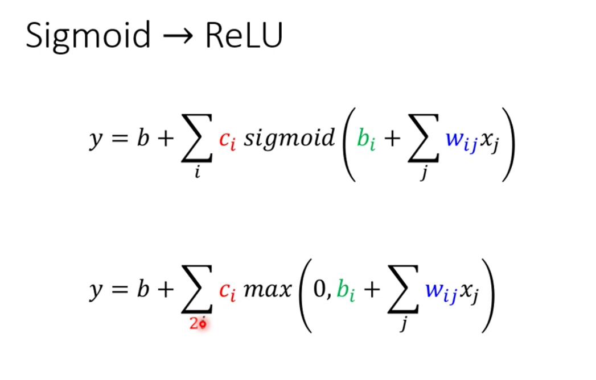
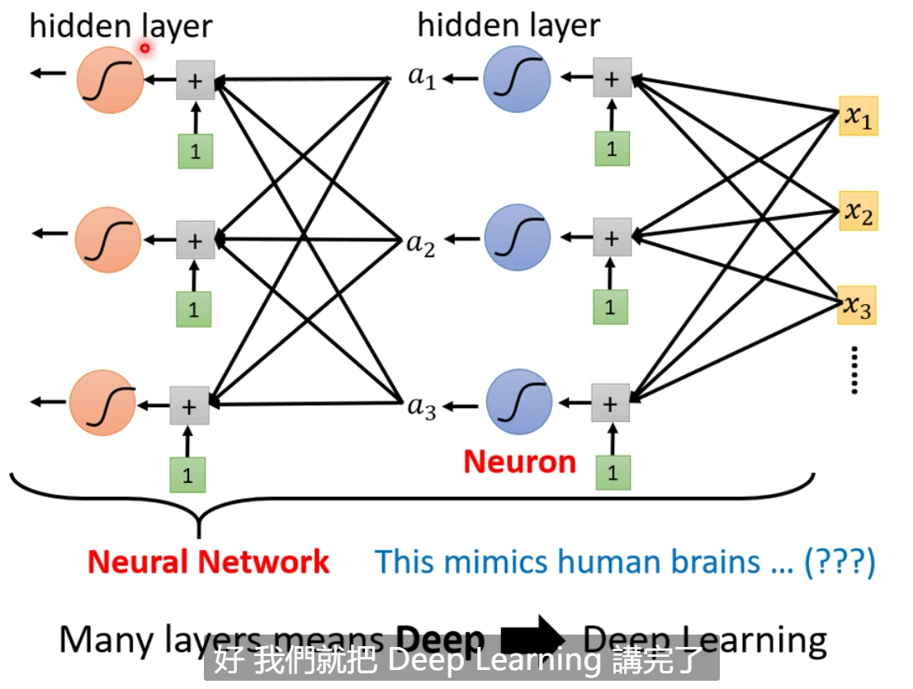

### Linear Model 太过简单

通过 Model Bias 来解决

如何拟合折线？多个函数+常数

如果是一般的曲线呢？

利用分段线性函数（Piecewise Linear Function）来逼近

将折线函数（hard sigmoid）拟合成Sigmoid函数，通过Sigmoid来拟合各种函数

得到新的模型

图解新的模型：

也就是如何从一个简单的线性模型转变为感知机

转化为矩阵形式

参数统一

梯度

两个ReLU构成Hard Sigmoid

激活函数：Sigmoid和ReLU

由感知机到神经网络

