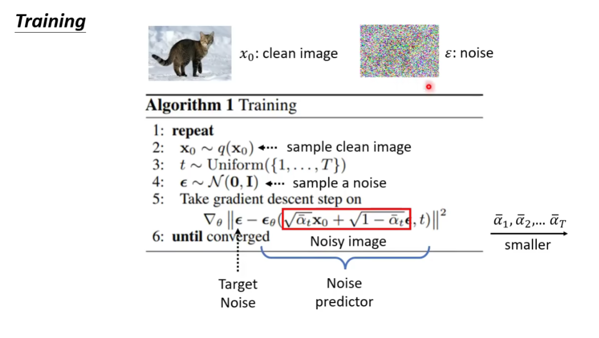
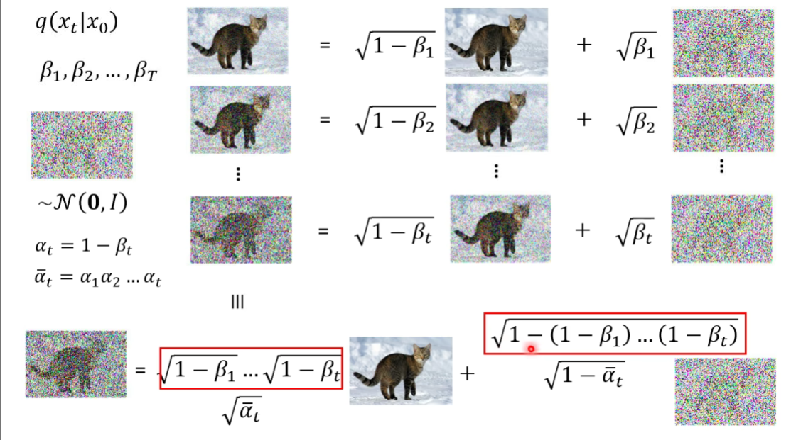

### Diffusion Model 扩散模型

#### Denosing Diffusion Probabilistic Models DDPM

如何运作的？

#### reverse process

生成一个杂讯的图片

本来图片就在杂讯里，只是滤掉不需要的部分

#### forword process

由一张训练集里的图像，添加噪声

算法

### Stable Diffusion

框架

FID 用来评估

CLIP

Decoder

中间产物：
- 小图
- Latent Representation

训练一个auto-encoder，将 decoder 拿出来就能用了

generation model

#### VAE v.s. Diffusion

#### 算法详解

训练

产生图

#### 影像生成模型本质上的共同目标

产生一个 distribution 和真正的有越接近越好

如何衡量“越接近越好”？极大似然估计

maximum likelihood = minimize KL divergence

#### VAE

产生 x 的概率：每个 z 产生的概率和每个 z 中产生 x 的概率

maximize 以得到尽可能大的 logP(x)（lower bound 下界）

#### DDPM

本来应该 sample n 次，但是可以只 sample 一次来代替

知道 x0，xt 求 xt-1

概率最大的不一定时最好的结果

所以用 sample 有随机性

