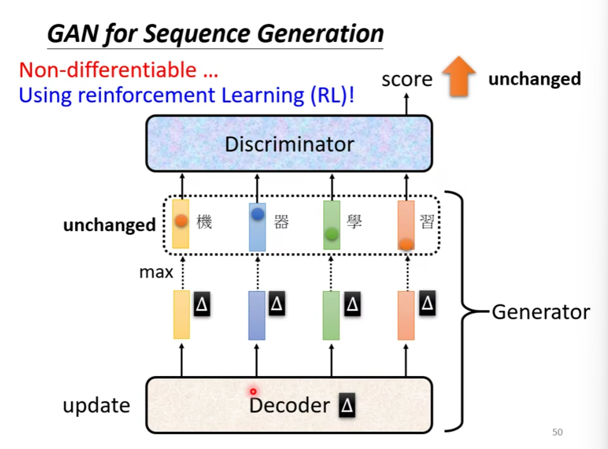
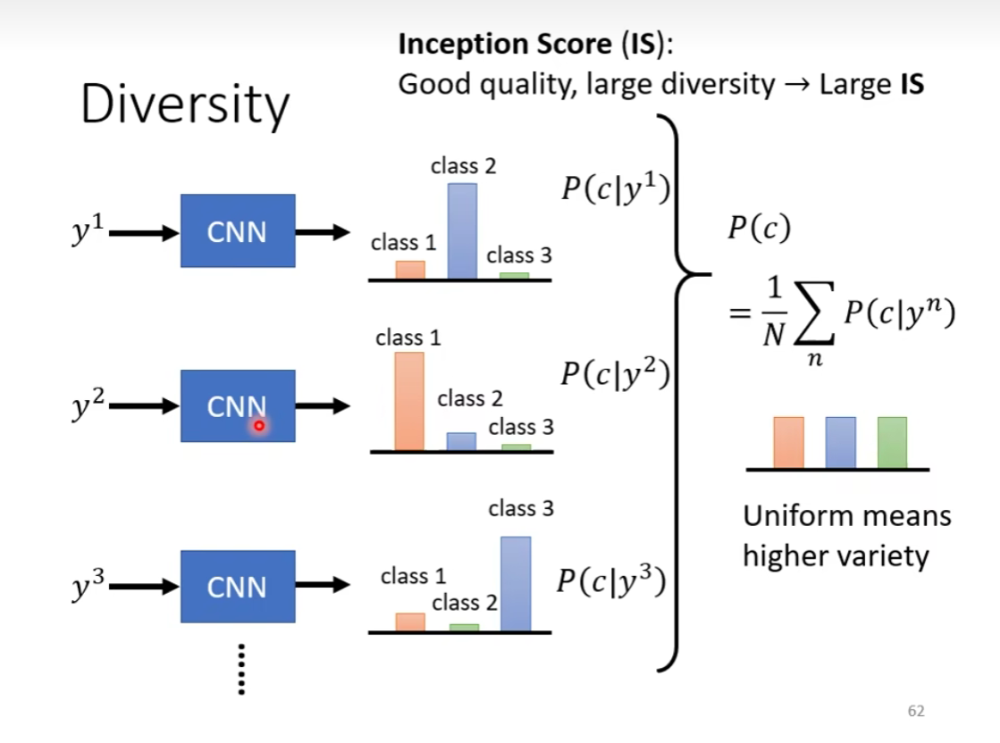

### GAN 生成式对抗网路

#### 生成式的模型

将 network 当作一个 generator

为什么输出需要是一个分布？

有可能两个输出都是最优的

给出概率来决定

需要创造力的模型对于分布很看重

"创造力" => 相同的输入但有不同的输出

#### Generative Adversarial Network GAN

从一个简单的分布到一个复杂的分布

generator 与 discriminator

由于这里是处理图像，所以 discriminator 的架构我们可能偏向于 CNN

#### GAN 的基本原理

"对抗" => generator 和 discriminator 之间相互影响，有点类似于相互监督的感觉

#### GAN 的训练目标

divergence 散度

Loss Function 就是两者的"距离"

#### 如何计算散度

通过 discriminator 

discriminator 其实就是一个分类器

maximize Objective Function = minimize cross entropy of binary classification 

也是一种"距离"的体现

最优化的一个过程

寻找一个 generator，去最小化

这里面的 generator 是固定的，在这个特定的 generator 下，寻找一个 discriminator 去最大化 V(G,D)

#### Tips for GAN

两个分布一般不重叠，为什么？

overlap 重叠

manifold 集合

JS 散度的问题：

wasserstein distance:

但在复杂的分布下，有许多的路径，这会导致有不同的 distance

wasserstein distance 在 JS divergence不能感知的范围内具有变化，让训练得以进行

#### WGAN

#### GAN for Sequence Generation

### Evaluation of Generation

一个分类系统，概率越集中，效果越好

Mode Collapse:discriminator 的盲点

这个生成的图像可以永远地骗过discriminator

Mode Dropping

Quality:一张图片的准确性

Diversity:一堆图片的多样性

FID:

单纯和训练集里的图像相同

#### Conditional GAN

打乱 pair 的正确匹配

GAN + Supervised Learning

#### Unsupervised Conditional Generation

没有正确匹配的 pair

Cycle GAN:两个 generator

也是一种限制:让两个 domain 有关系

正反向训练同时进行

