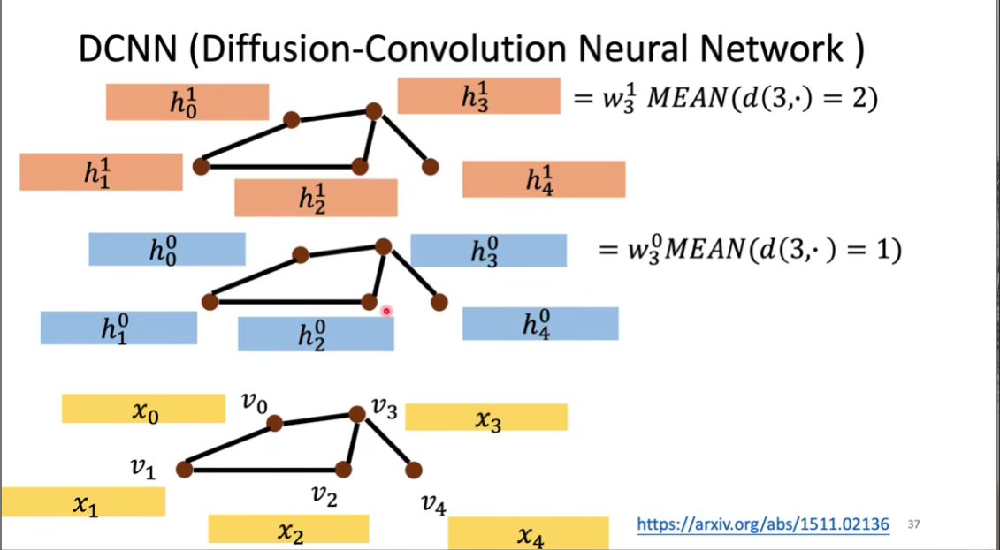

### GNN 图神经网络

#### graph 的介绍

graph 是由节点和边组成的

边有边的性质，节点有节点的限制

#### 为什么需要 GNN？

数据之间存在一些潜在的结构和关系

#### Spatial-based GNN

e.g. NN4G (Neural network for graph)

e.g. DCNN (Diffusion-convolution neural network)

用距离来计算对应的节点

**GAT Graph Attention Network**

对相邻节点做 Attention

可以读下论文

GIN 给出一些理论

助教讲的不是很好，另找别的来看

