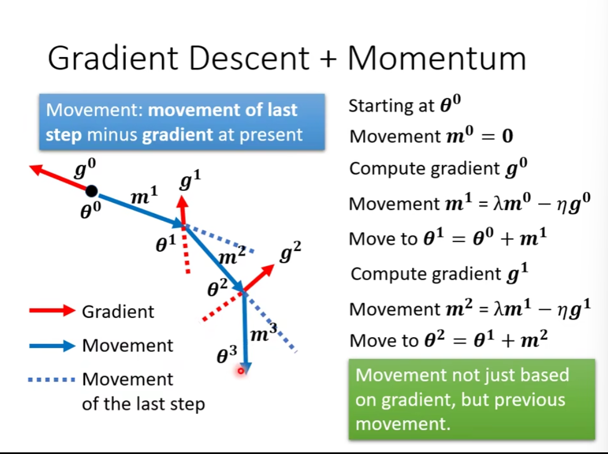
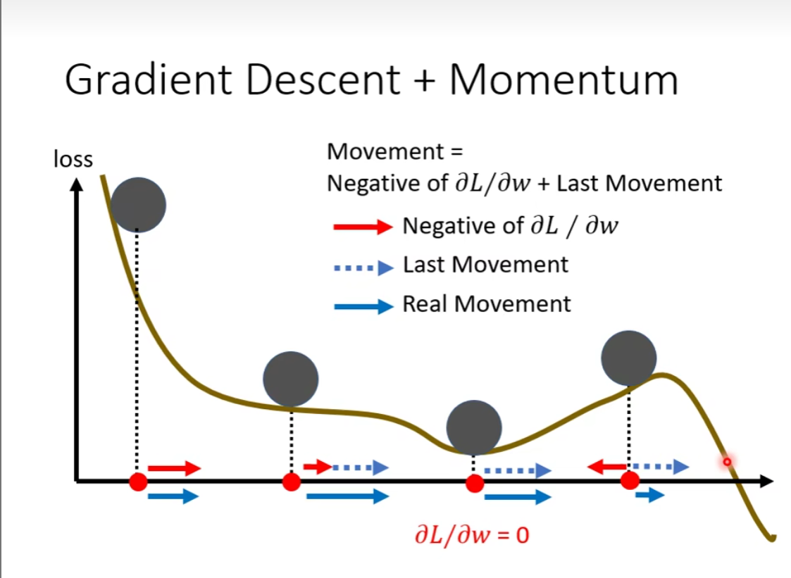
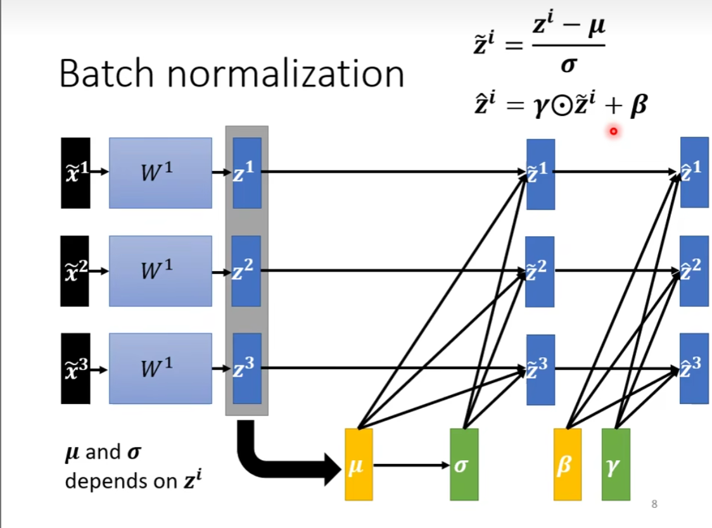

### 类神经网络训练不起来？（一）

gradient is close to zero —— critical point

#### local minima 局部最小值

no way to go

#### saddle point 鞍点（不是局部最小值）

can escape

如何判断微分为 0 的时候是哪种情况呢？

通过泰勒展开来近似

H 是海森矩阵

通过线性代数来判断：

如果 H 是正定的——其所有特征值都是正的

反之，H 是负定的——其所有特征值都是负的

如果 H 特征值有正有负，那么就是鞍点

H 可以给出更新的方向

u 是特征向量

那到底是局部最小值这种情况多呢，还是鞍点多呢？

假说：

### 类神经网络训练不起来？（二）

#### 回顾:batch 批次

shuffle 打乱，每一个 epoch 重新分 batch

#### small batch v.s. large batch

平行运算

noisy 的 batch 反而会提高训练效果

为什么？

每个 batch 的 loss function 略有差异

局部最小值的好坏

small batch 具有一定的随机性

#### 总结

#### momentum 动量

类比物理现象：

##### 一般的 gradient descent

##### gradient descent + momentum

update不仅仅只取决于gradient的方向，还考虑了之前移动的方向

形象化解释：

### 类神经网络训练不起来？（三）

#### Adaptive Learning Rate

迈出的步伐太大了，导致结果在震荡

σ 既取决于参数，又取决于更新的次数

#### Root Mean Square 均方根

#### RMS Prop

可以自己决定每个参数的权重

#### Adam: RMSProp + momentum

细节见论文

#### Learning Rate Scheduling

##### 学习率衰减 lr decay

##### warm up

lr 先增加，再减小

#### 总结

### 类神经网络训练不起来？（五）

#### batch normalization

需要尽可能相同的数值范围

#### feature normalization

批归一化

batch 需要一定的大小，才能得出分布

还原可能的一些情况

测试上采用的方法

