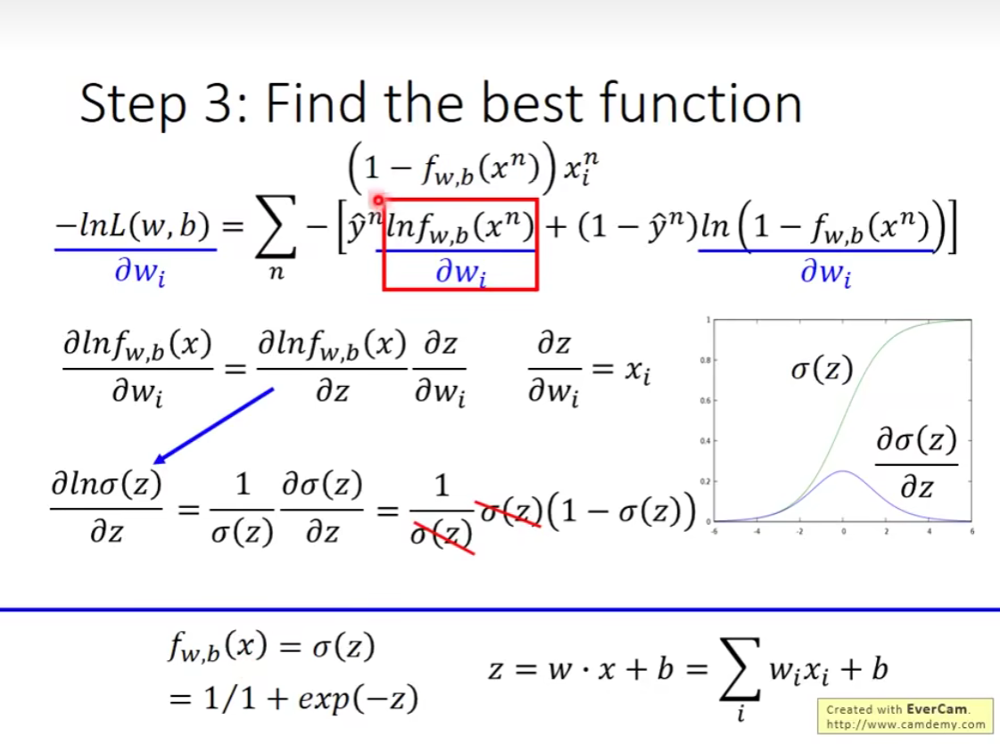
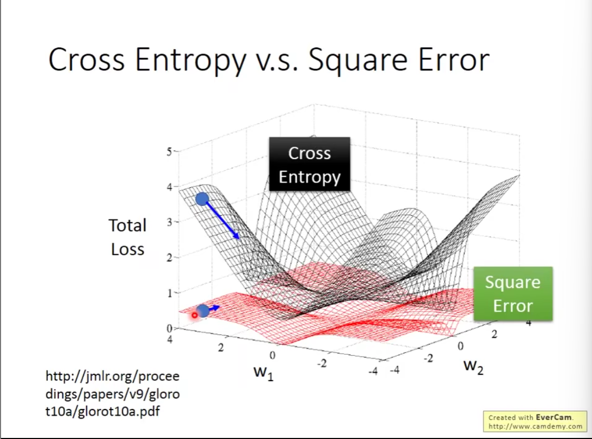

### 逻辑回归

#### step1

#### step2

##### 交叉熵

#### step3

误差越大，更新也就应该越大——合理的结果

### 线性回归 v.s. 逻辑回归

为什么更新结果会是相同的式子呢？因为它们都是属于**广义线性模型**

为什么逻辑回归不用 Square Error？

两种情况得到相同的微分结果

离目标的距离很远，梯度下降速度很慢

### 判别学习算法 v.s. 生成学习算法

一般地，当数据集很小时，生成学习算法表现更好，生成学习算法有着自己的假设；当数据集比较大时，判别学习算法表现更好

但是具体情况下表现也可能不同

生成学习算法的优点：
    - 更少的训练数据
    - 对噪声鲁棒性更大
    - 先验和独立的概率可以来自不同的data

### 多分类 softmax 回归

通过 softmax 函数进行变换

softmax 函数将 output 限制在 (0,1)

softmax 变换原理？

### 逻辑回归的限制 

无法分类

看到这个图应该就想起来了感知机无法处理异或问题这个经典的 case

可能的处理方式：feature transformation 特征映射

不是总能找到一个好的特征映射

希望机器可以自己找到这样一个映射

考虑的方法：通过多个逻辑回归来实现

其实也就是一个神经网络

一个简单的逻辑回归可以看作一个感知机

多个逻辑回归的拼接就是神经网络

