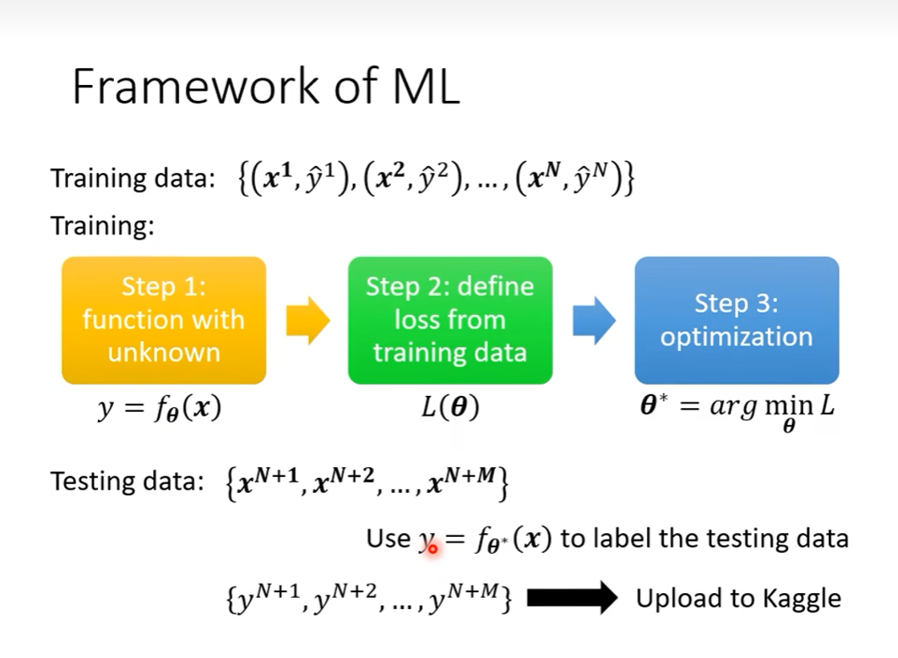
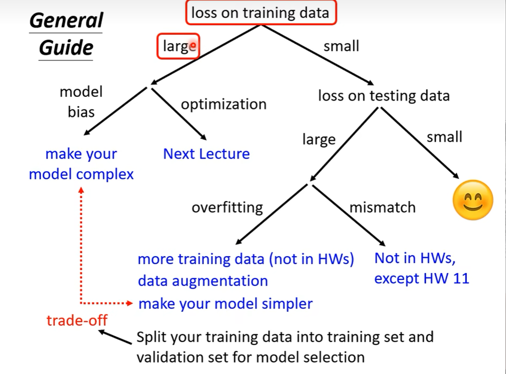
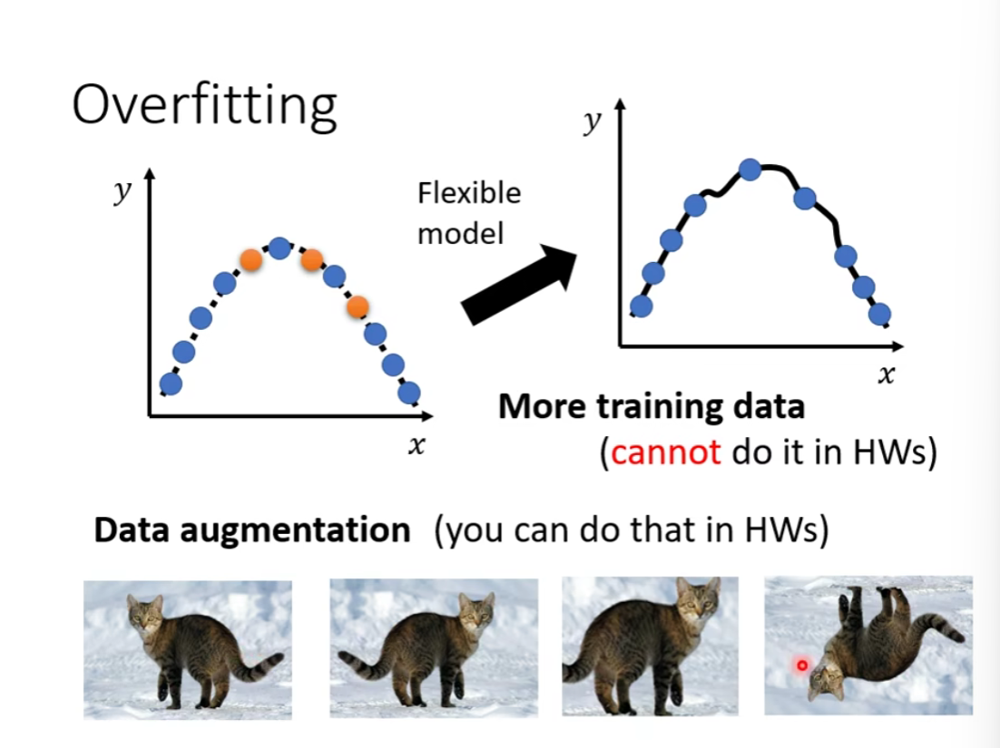
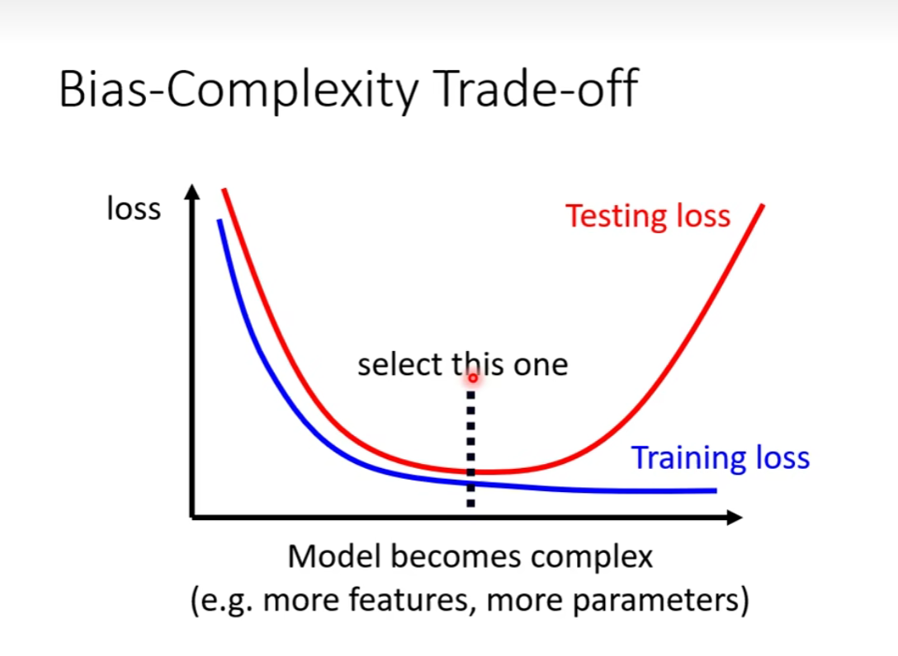
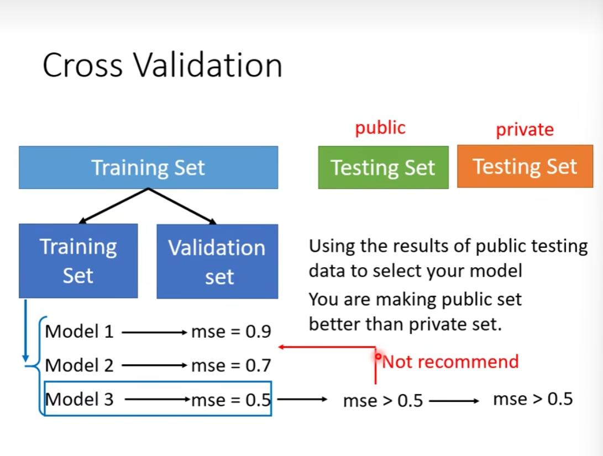
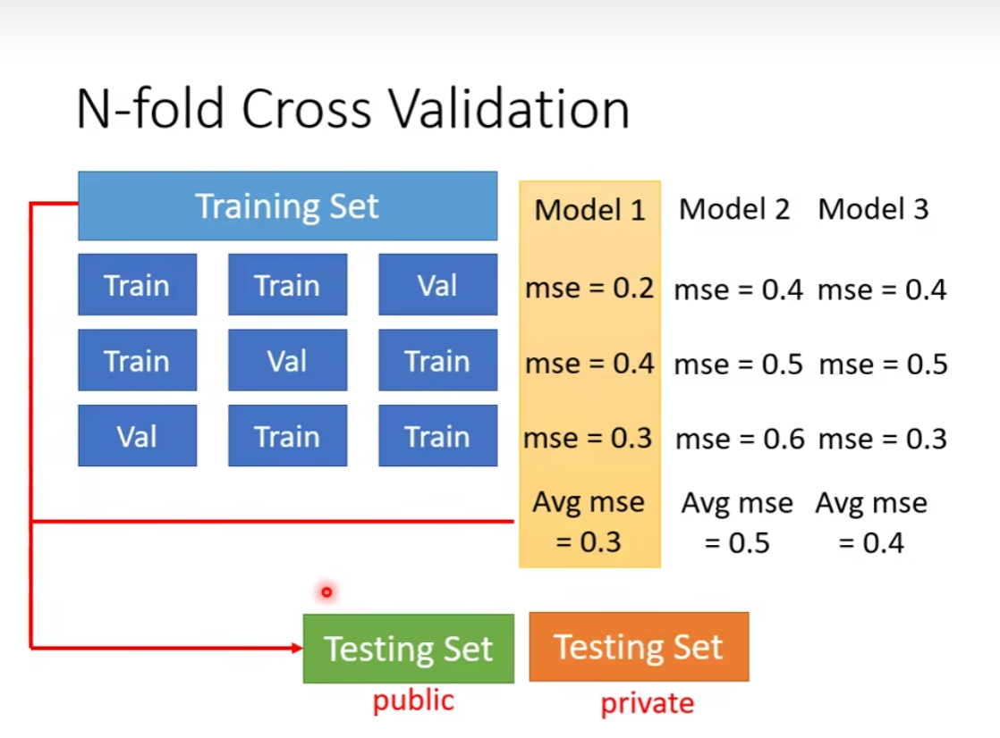
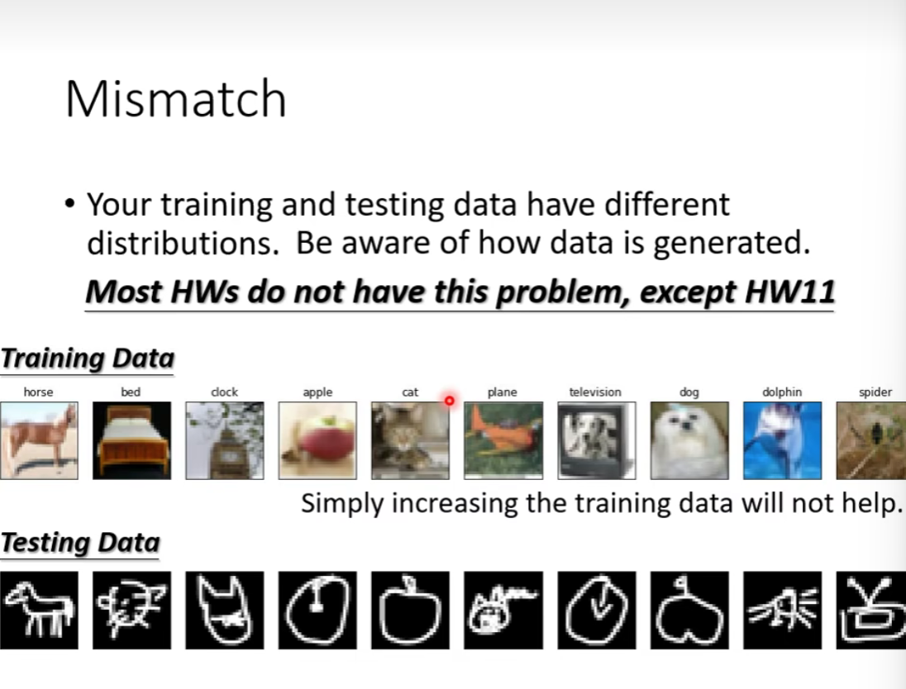

### 机器学习的框架

### 如何优化机器学习

先检查一下 training data 

training loss 偏大：
- model bias —— 模型太过简单 —— 重新设计模型

- optimization issue —— 优化方法不好 —— 存在 loss 很低的 function set，但是找不到

如何确定是上面的哪种情况？

- 不同网络结构进行对比
- 从简单的网络开始，对比深的网络

如何是优化不好，应该采取更强力的优化策略

training loss 很小：

看 test loss

test loss 偏大

- overfitting
-  

解决 overfitting 的方法

- data augmentation
- 给出限制 constrain

如何去给出限制？

- 更少的参数，共享参数
- 更少的特征
- 早停法 early stopping
- 正则化 regularization
- 丢弃法 dropout

但过大的限制会导致重新出现 model bias 的问题

### 交叉验证

### N 折交叉验证

### Mismatch

