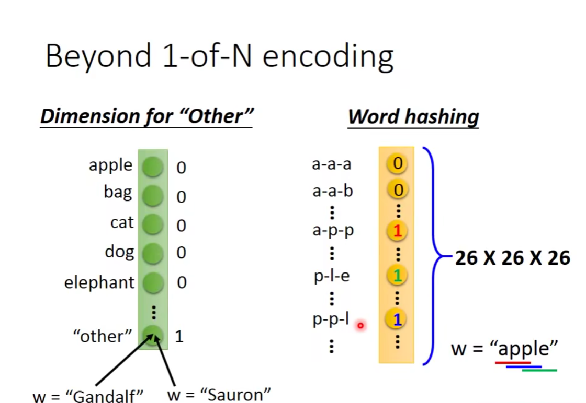
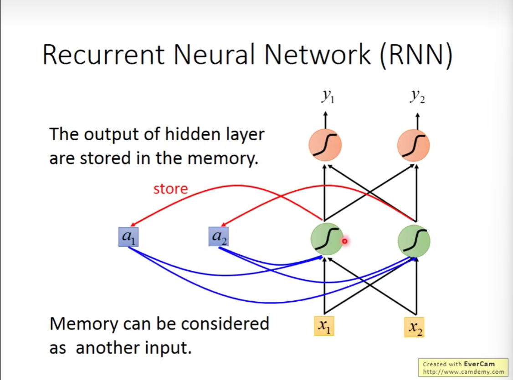
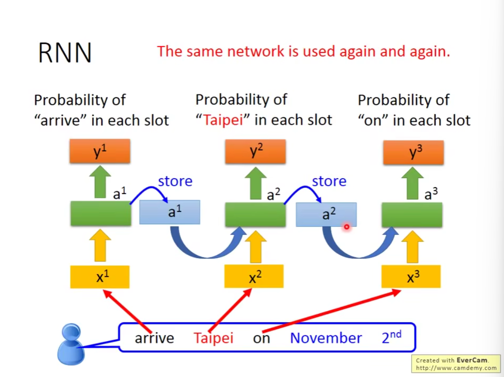
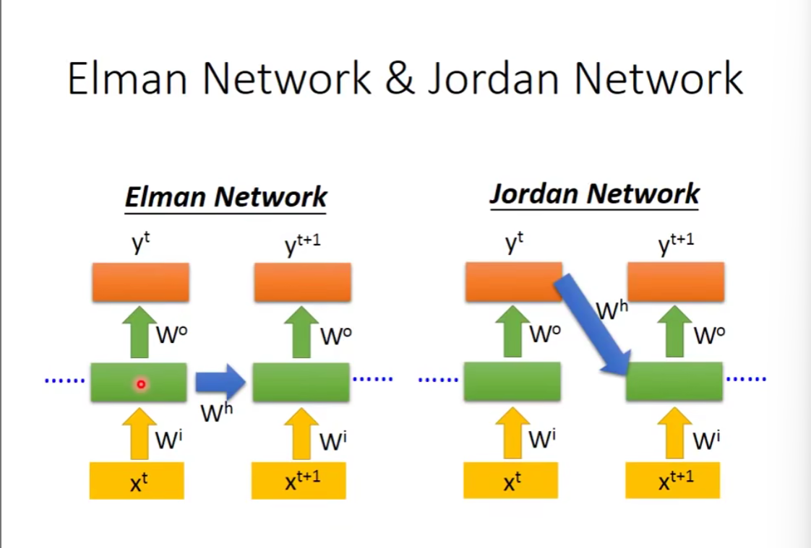
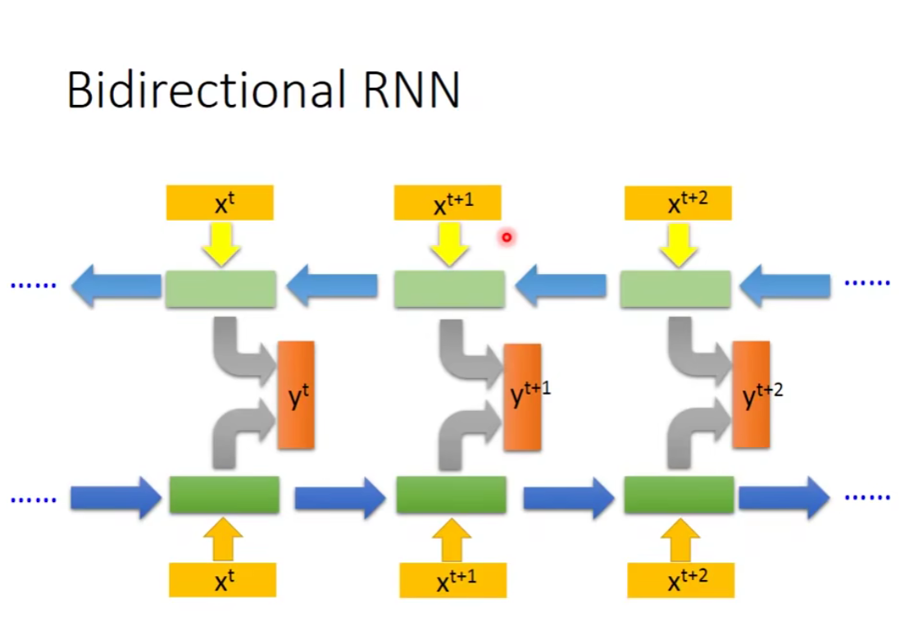
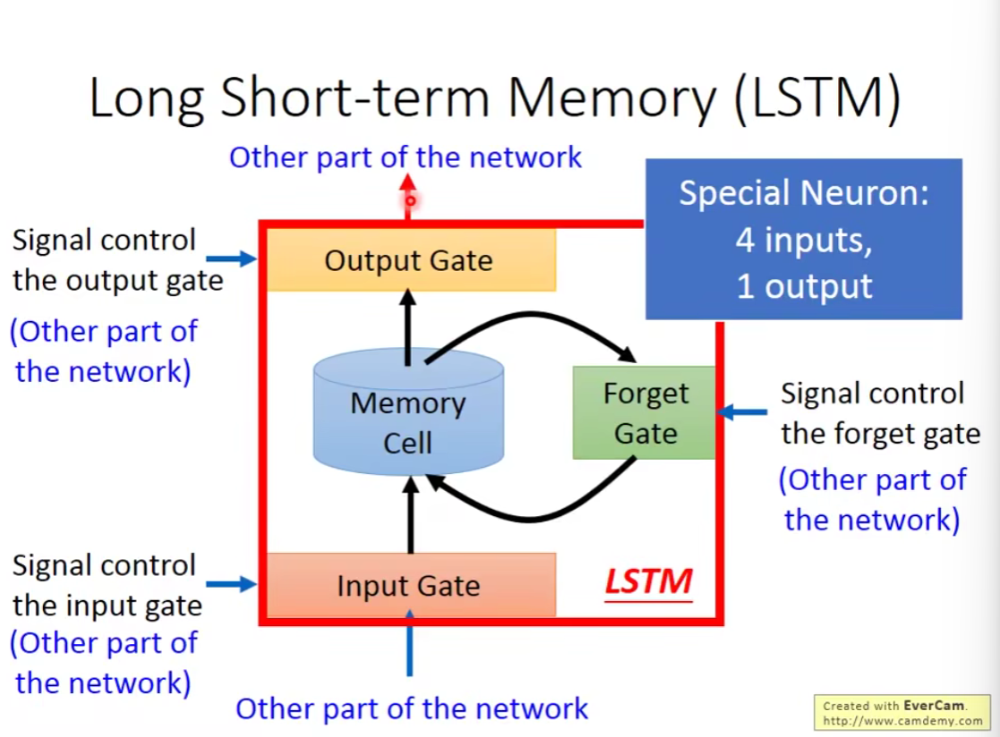
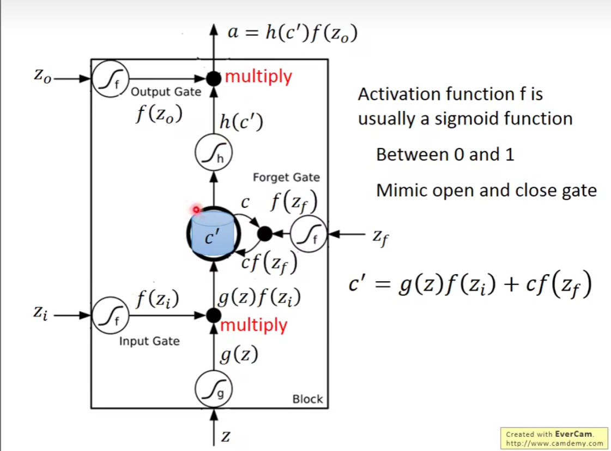
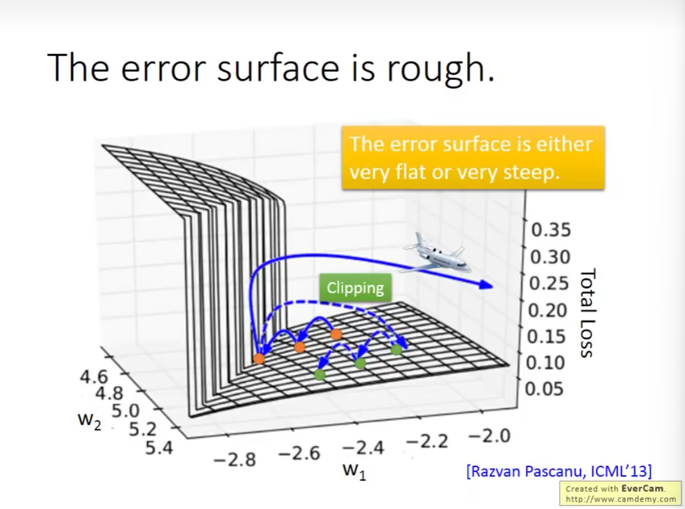
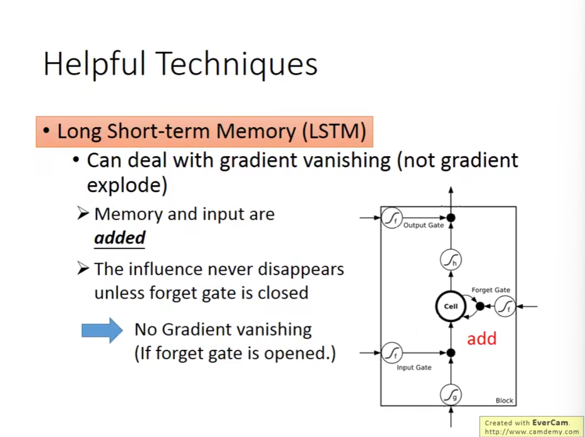
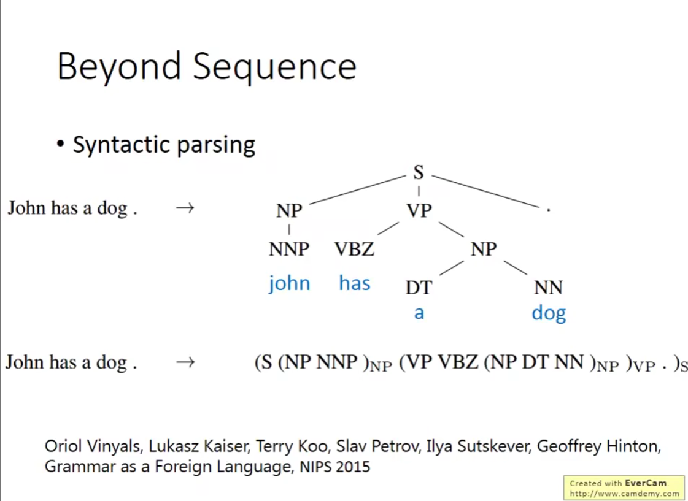

### 循环神经网络 Recurrent Neural Network

#### slot filling 槽填充

##### 1. 意图识别
首先，系统需要识别用户的意图。这通常通过机器学习模型或规则匹配来完成。比如：

- **用户输入**: “我想预订一个去巴黎的航班。”
- **识别的意图**: 预订航班

##### 2. 槽识别
接下来，系统从用户输入中提取关键信息，即槽。这些槽通常是预定义的，例如：

- **槽**:
  - **目的地**: 巴黎
  - **出发日期**: （假设用户没有提到，系统可以进一步询问）
  - **返回日期**: （同上）
  - **舱位**: （用户可能会指定经济舱或商务舱）

##### 3. 槽填充
在这一阶段，系统需要填充槽的信息。若某些槽的信息缺失，系统可以通过进一步提问来获取。例如：

- **系统提问**: “您打算什么时候出发？”

表示方法：

beyond 1-of-N encoding

加入一个 dimension for "other"

输入：a word

输出：input属于哪个slot的概率

根据上下文产生不同的 output

neural network 需要记忆——RNN

#### RNN 介绍

记录下 hidden layer 的 output 作为 memory

memory 也可以作为下一层的输入

在 RNN 里，给出一样的input，由于memory的影响，也会可能有不同的输出

input之间不是独立的，改变输入顺序就会改变输出

例子：

同一个 network 在不同的时间点使用了3次，而非多个network

两种 RNN：

#### Bidirectional RNN 双向RNN

network 考虑的范围更广

#### Long Short-term Memory LSTM

基本结构：

比较长的 short-term Memory

forget gate 跟直觉相反

=1 时是打开，保存记忆；=0时是关闭，遗忘记忆

LSTM 相比一般的 network 需要4倍的参数

#### RNN 的训练

training => Backpropagation through time BPTT

RNN 并不好训练

Clipping 截断

同样的 weight 在不同的时间点被反复地使用

改进 => 使用 LSTM

#### Gated Recurrent Unit GRU

读论文

#### Application 应用

RNN 可以使用的情形：

- input and output are both sequences with the same length
- many to one:input is a vector sequence, but output is only one vector(sentimetn analysis)
- many to many:both input and output are both sequences, **but the output is shorter**(speech recognition)
- many to many(no limitaion)seq2sqe:both input and output are both sequences with different lengths

对于语音识别，CTC 处理叠字问题

**sequence to sequence learning**

beyond sequence

后面的内容基本在介绍一些复杂的模型...非常迷

