### Transformer

#### 什么是 sequence to sequence (seq2seq)

input a sequence, output a sequence

the output length is determined by model itself

e.g. 语音辨识、机器翻译、chatbot、QA

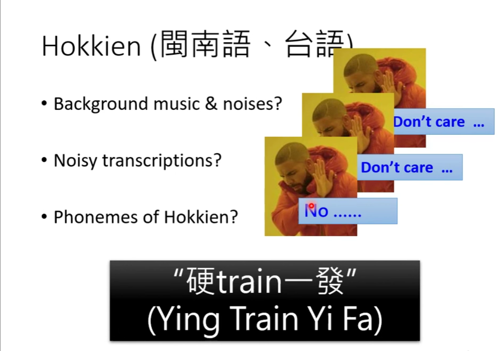

哪些任务可以使用 seq2seq？

- 语法解析
- Multi-label Classification

不是多分类（Multi-class）

An object can belong to multiple classes

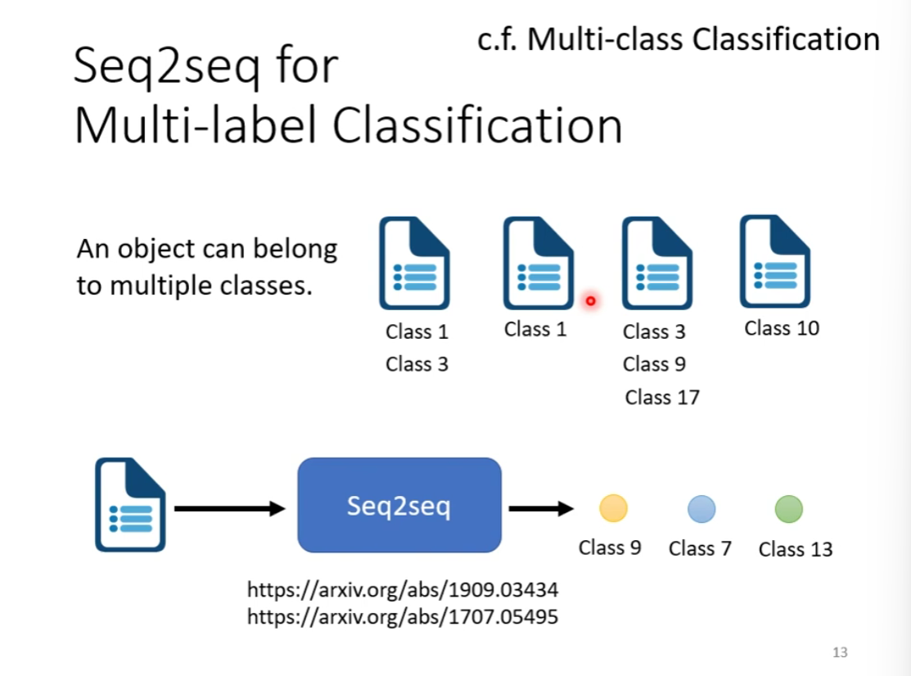

#### seq2seq 解析 —— transformer

Encoder 和 Decoder

#### Encoder

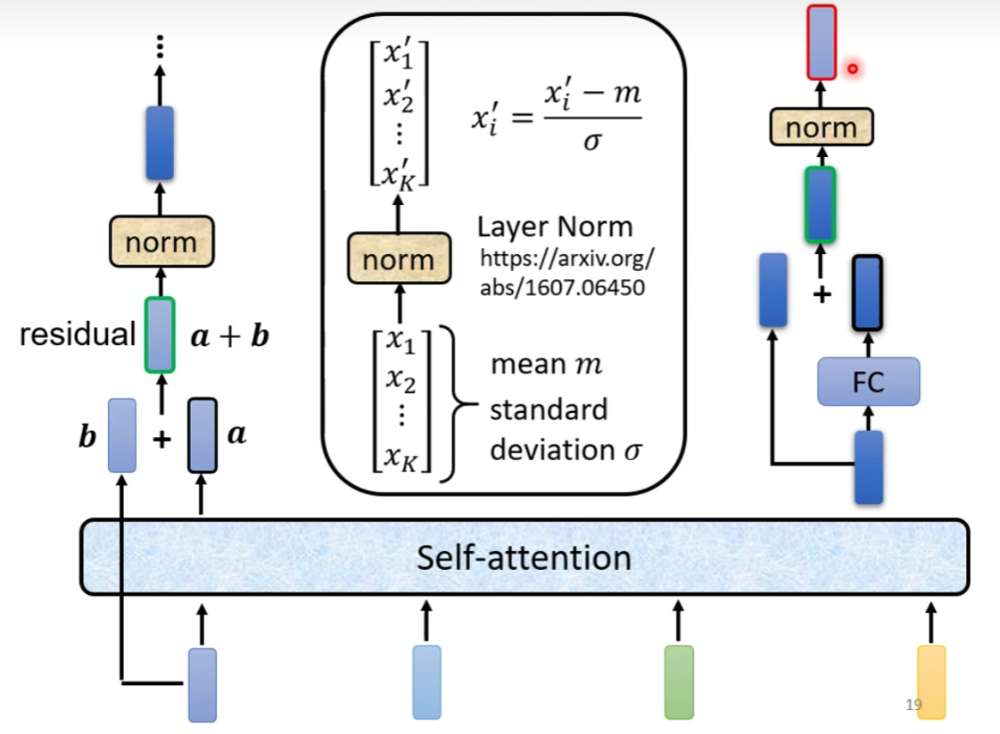

residual layer：残差层

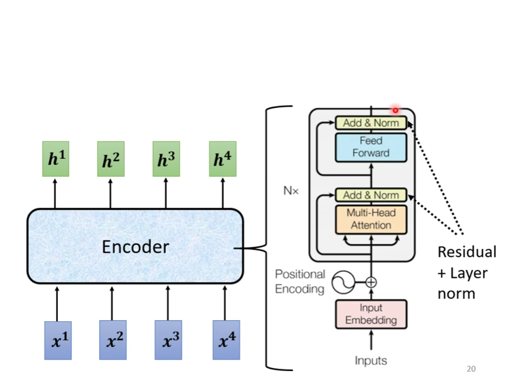

#### Decoder

- Autoregressive（AT）
- Non-Auto regressive（NAT）

Masked self-attention：只考虑前面的输出以及自己

如何让 decoder 停止？END 表示

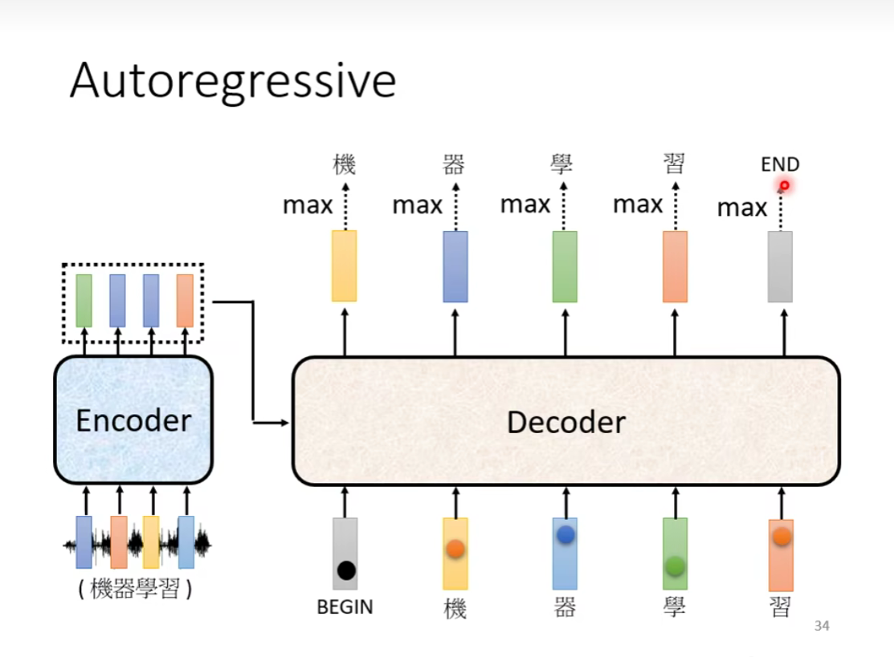

#### AT v.s. NAT

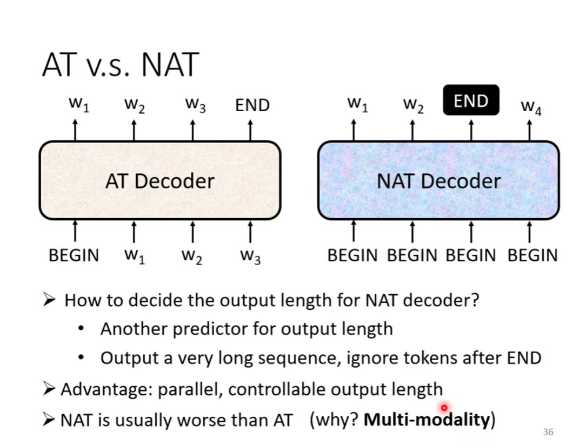

#### Encoder 和 Decoder 的传递

cross attention

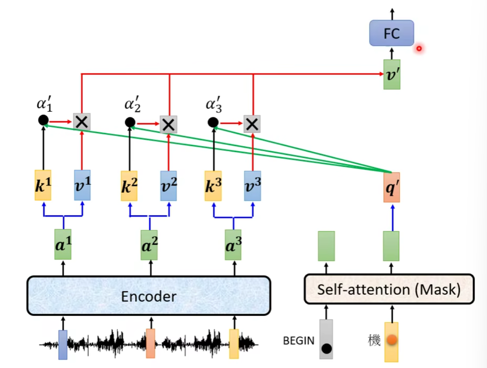

#### training

类似于分类问题

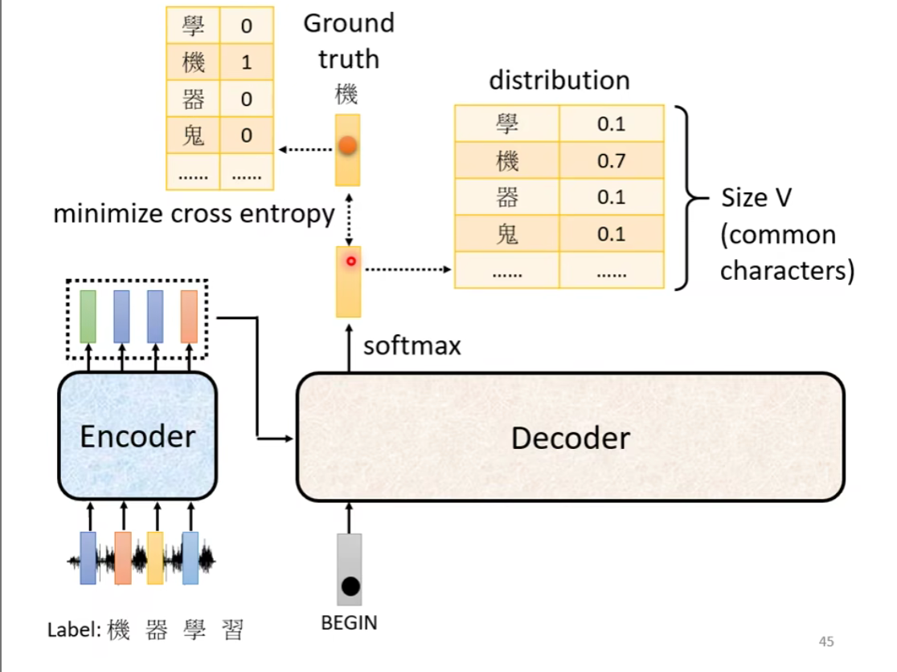

teacher forcing

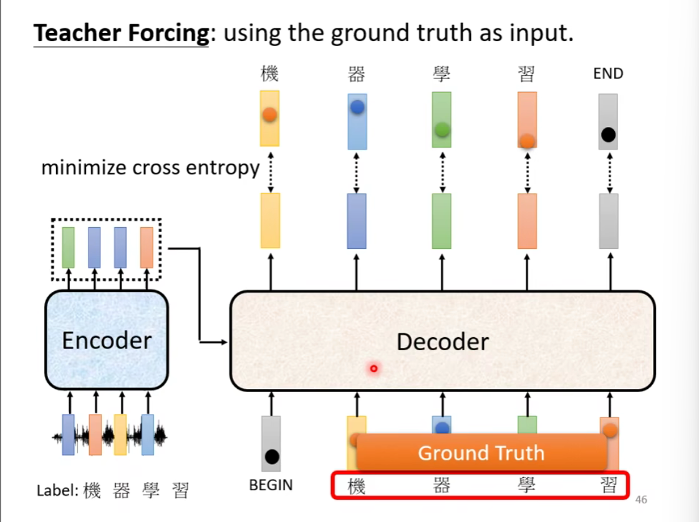

tips
- Copy Mechanism：某些词汇可能是重复的（name，摘要）
- Guided Attention：在某些任务中，Attention 需要某种固定的形式
- Beam Search

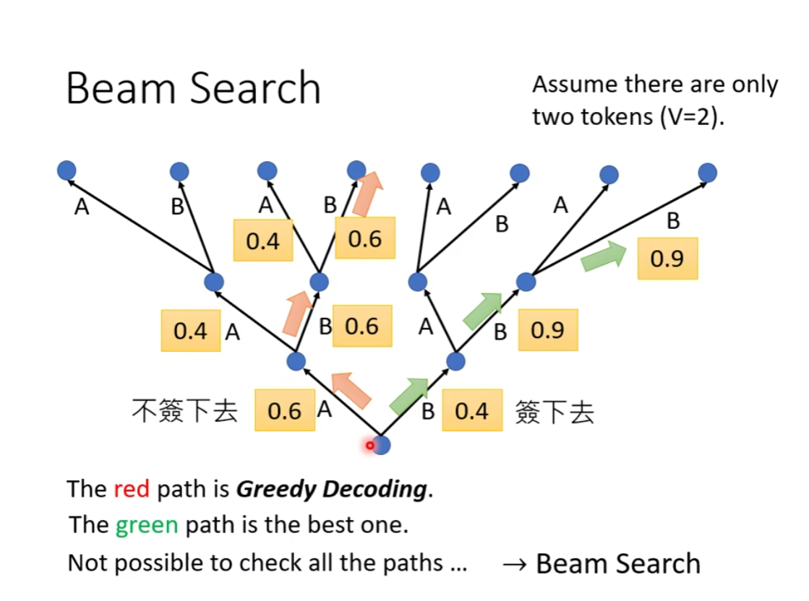

有些任务需要一些随机性（noise）

#### exposure bias

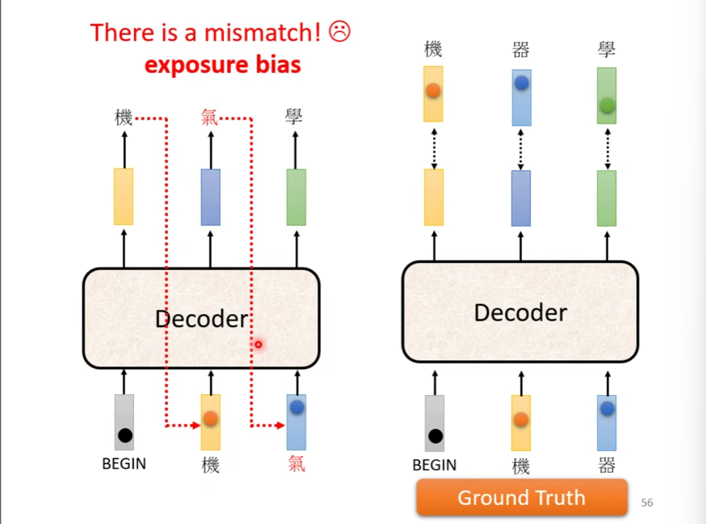

测试中没有正确的答案（但训练时我们给decoder看了正确的答案）

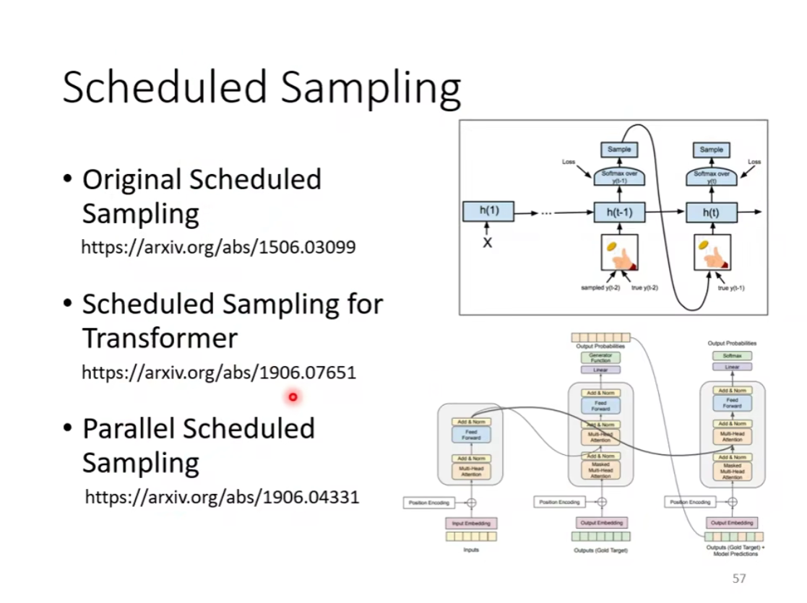

加入一些错误的样本

