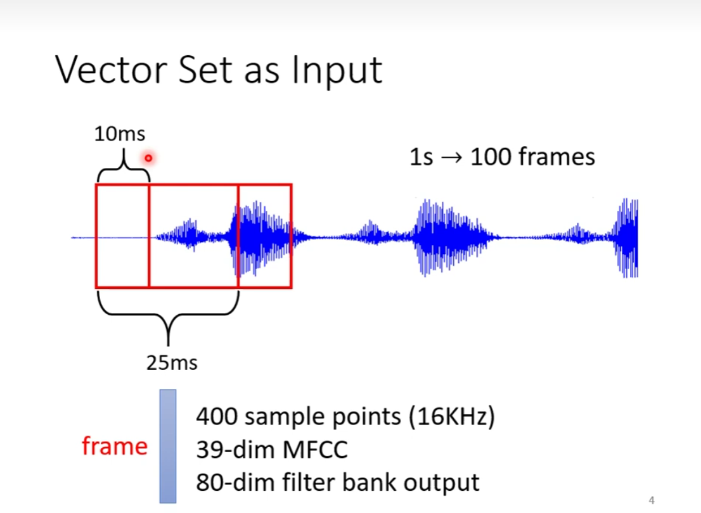

### self attention

#### sophisticated input 复杂的输入

e.g. 文字处理

one-hot encoding or word embedding

e.g. 语音处理

e.g. 一个图

e.g. 一个分子

#### 输出是什么呢？

- each vector has a label（输入和输出数目一样）
- the whole sequence has a label
- model decides the number of labels itself（seq2seq）

#### 例子：sequence labeling 词性标注

**自注意力机制**

- step1：find the relevant vectors in a sequence

如何得到相关度 α 呢？

一个计算 attention 的模组

常见的计算方式：

dot-product: 分别乘上两个不同的矩阵再做点积（element-wise）

对 attention score 做 softmax（也可以不用softmax）做一个 normalization

q —— Query k —— Key

可以同时计算的（parallel）

#### 矩阵乘法简化

#### 总结

需要学习的参数只有三个

#### Multi-head Self-attention

#### Positional Encoding

为每个位置设定一个 vector

### 应用

truncated self-attention => 语音辨识

考虑一小个的范围

**self-attention 的适用范围：输入是vector set**

#### self-attention v.s. CNN

读一下

CNN 是 self-attention 的特例

#### self-attention v.s. RNN

#### self-attention for graph

consider edge 考虑边

