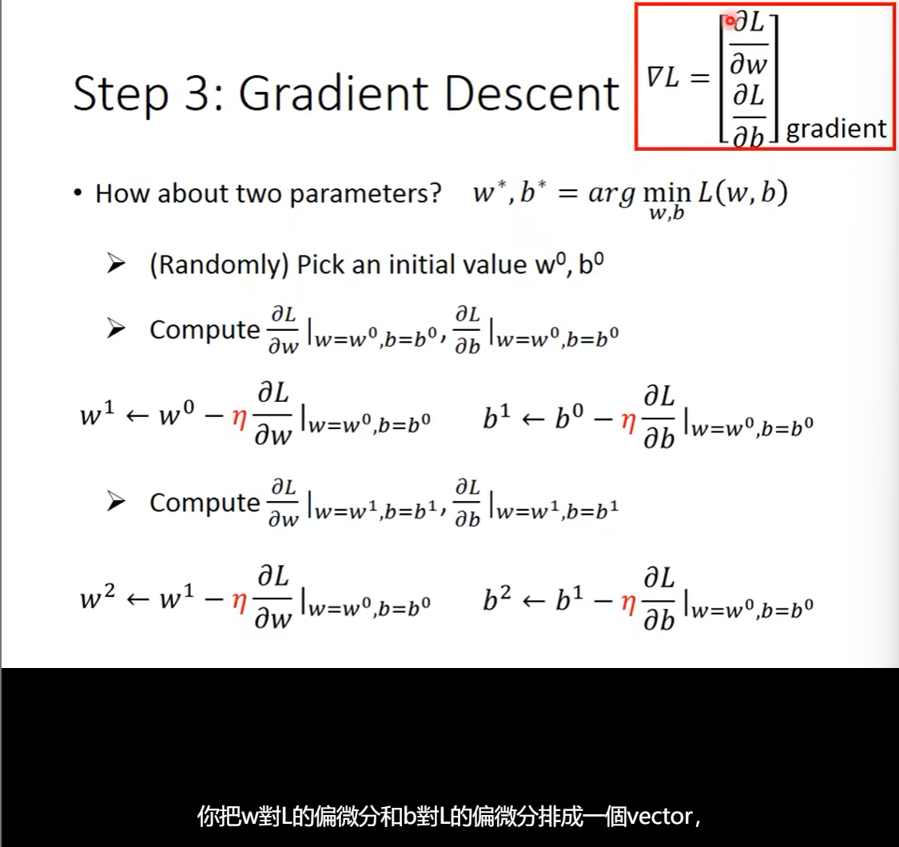
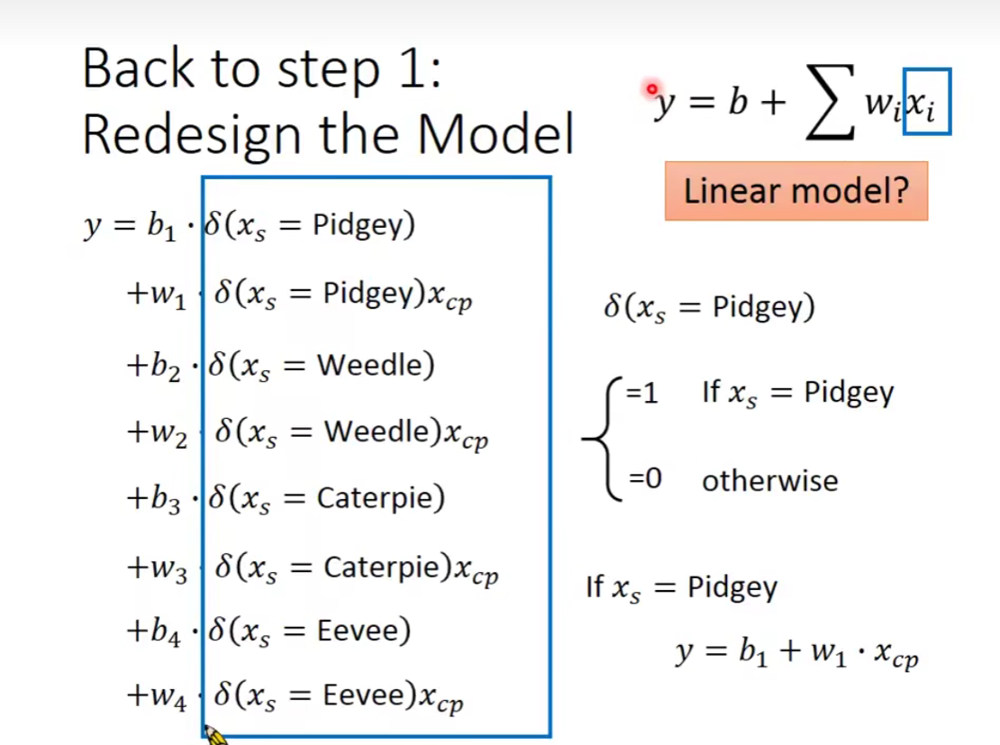
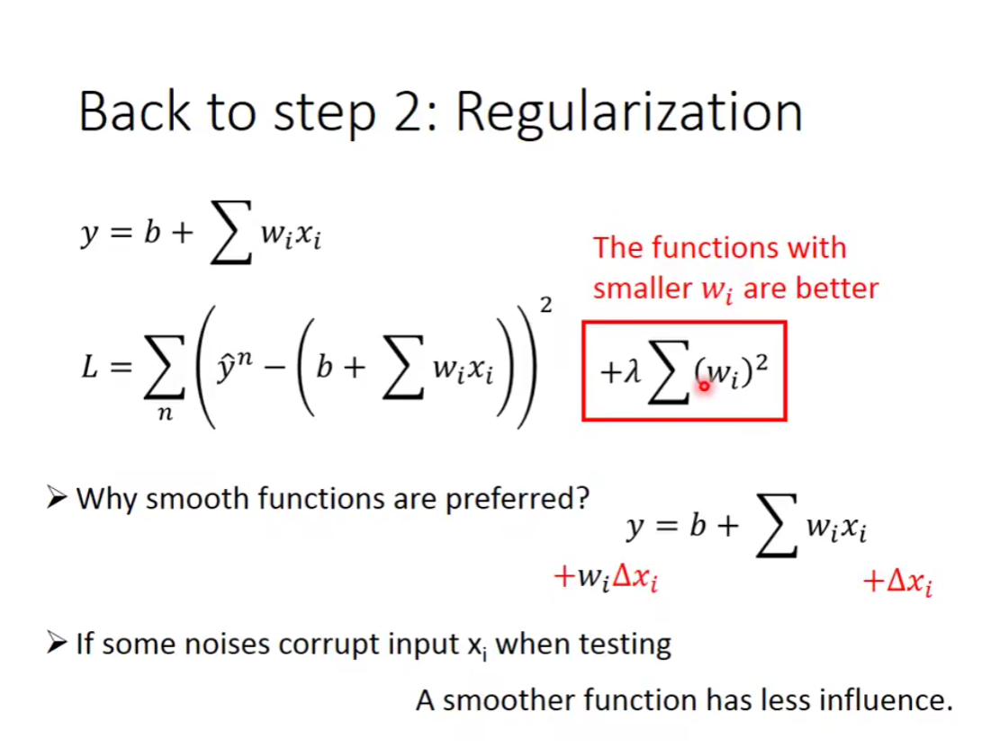

### Regression 回归

在线性回归里，损失函数是收敛的，没有局部最优值

#### Overfitting 过拟合
 
越复杂的模型在测试集上不一定会取得更好的结果。

#### Regularization 正则化

对正则化的解释

引入正则项后，为了使得 L 最小，那么需要尽可能的得到更小的 w

更小的 w 会给模型带来一个改变：模型会更加平滑

为什么平滑的模型更好呢？

更平滑的模型意味着对输入的敏感度（sensitive）更低

噪声对输出结果的影响也会更小

但也不是越平滑的模型就越好

考虑调整 λ 的值

正则项里不考虑 bias——bias对平滑没有影响

#### 总结

也就是说我们希望提高模型的泛化能力，以提高其在未见过的数据集上的表现。正则化是一个有效的手段，但是过度的正则化会使模型陷入欠拟合，也就是失去了对原本的输入特征的捕捉
