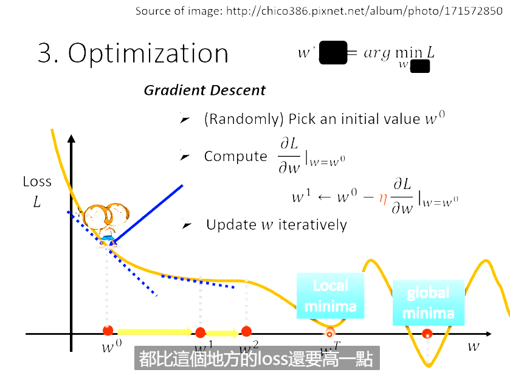

### 什么是机器学习

Machine Learning ≈ Looking for a function

### 机器学习分类

#### Regreission 回归

函数输出是一个数值（scalar）

#### Classification 分类

给出选项（类别），函数选择一个正确的输出

不只有二分类，还有多分类

#### Structure Learning 结构学习

函数创建一个有结构的东西（比如图像，文本）

### 如何找出函数

#### 1.给出一个基本的函数假设（Function with Unknown Parameters）

如何确定这个假设？

—— Domain Knowledge（领域知识）：在某一个领域上的先验知识

Model —— Function with Unknown Parameters（带有未知参数的函数）

e.g.

y = b + wx

x 叫做 feature（特征），w 叫做 weight（权重），b 叫做 bias（偏置）

#### 2.从训练数据定义Loss

Loss is a function of parameters 

e.g. L(b,w)

Loss 评价了这一组参数的好坏

ei = |y - yhat|

yhat 叫做 Label（正确的、真实的数值）

L = 1/N * Σei

e = |y -  yhat| -> MAE mean absolute error

e = (y - yhat)^2 -> MSE mean square error

error surface -> 等高线图

#### 3.优化（Optimization）

最优化问题

w*, b* = argmin L(b,w)

常用方法：梯度下降（Gradient Descent）

#### 4.修正

根据预测结果对模型进行修正——基于 domain knowledge

y = b + Σwjxj

—— 这类模型叫做 Linear Model（线性模型）