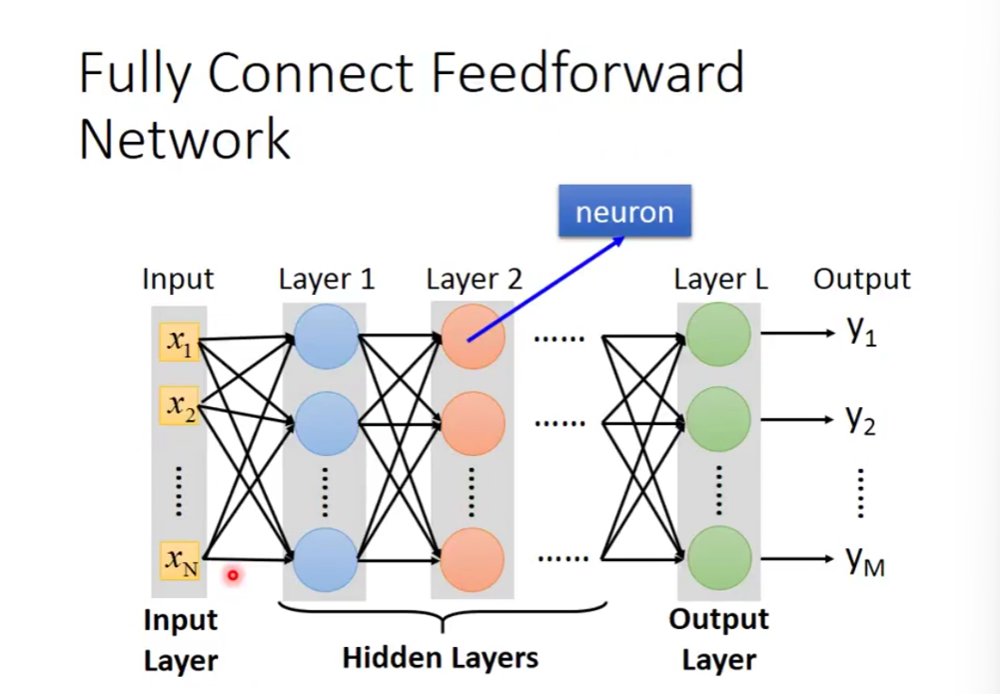
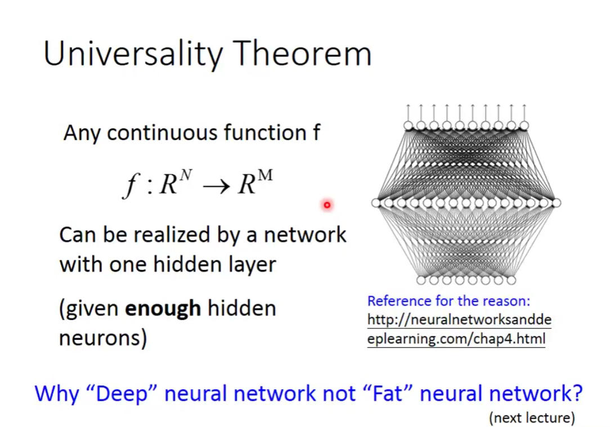

### 深度学习的历史

- 1958 Perceptron 感知机
- 1969 Perceptron has limitation
- 1980s Multi-layer perceptron 多层感知机
- 1986 Backpropagation 反向传播
- 2006 RBM initialization
- 2009 GPU
- 2011 start to be popular in speech recogition
- 2012 win ILSVRC image competition

### 如何做深度学习？

#### 1.define a set of function

function = neural network

什么是神经网络？——由神经元构成

什么是神经元？——由拟合的函数构成

不同的连接方式可以构成不同的神经网络

- Fully connected feedforward network 全连接前馈神经网络：前后两层的神经元间全部两两相连

**给出一个神经网络的结构（连接方式），就是定义了一个函数集（参数是未知的）**

deep = many hidden layers

为什么用矩阵运算？——可以用GPU加速运算

#### 2.goodness of function

定义一个函数的好坏

e.g. 在softmax回归中，用交叉熵来评估

然后找出一组参数，最小化Loss

优化方法：梯度下降

#### 3.pick the best function

